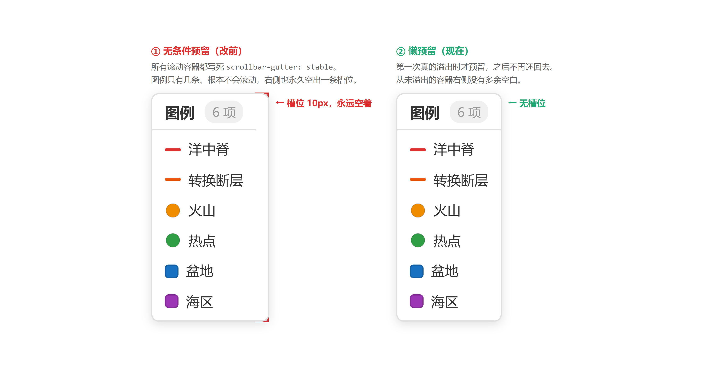
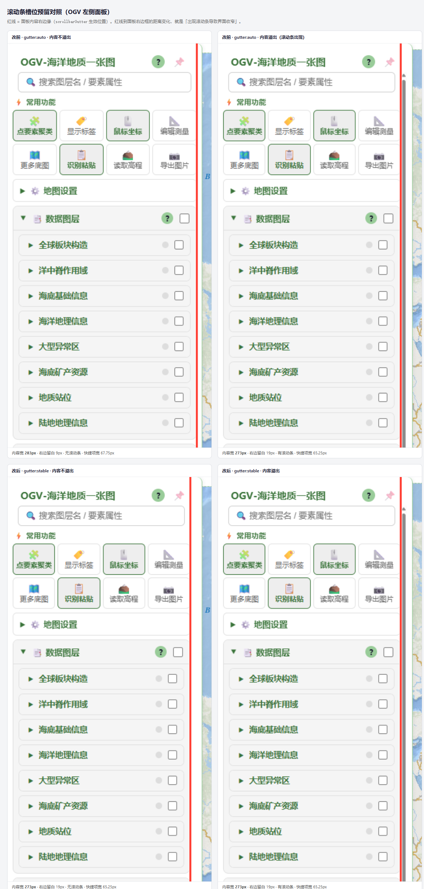
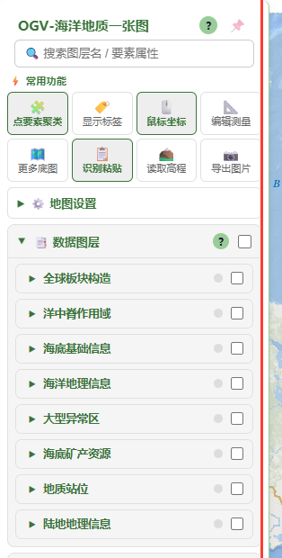
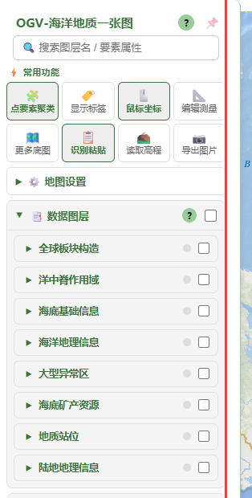
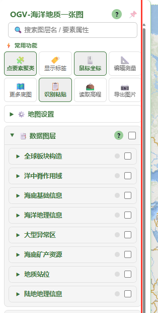
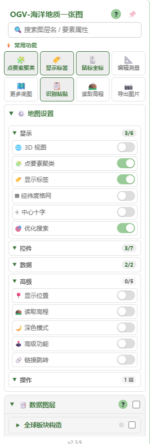
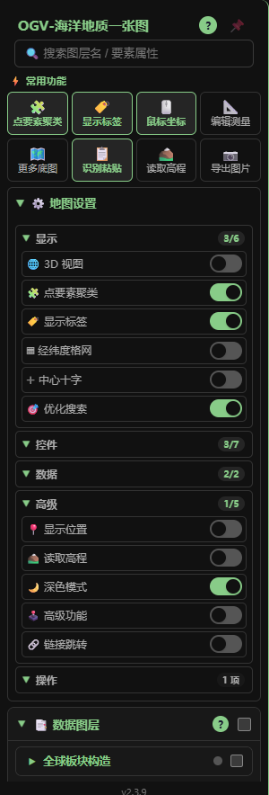
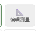

# 更新记录

## 2026-09-12（e）— 「更新记录」内嵌对照图 + 弹窗图片查看

> 本版起版本号定为 **v2.4.0**（正式发布号）。此前 v2.3.9 / v2.3.10 / v2.3.11
> 是同日中间态，未单独发布。

### 起因

`docs/shots/` 里攒了 14 张验证截图（1.49 MB），但正文里只用反引号写了路径 ——
在 App 弹窗里就是一行纯文本，读者看不到图。改成 Markdown 图片语法。

改的过程中撞到一个必然踩的坑：**`marked` 不做路径重写**。

### 坑：Markdown 里的相对图片路径按「页面 URL」解析，不是按文档

`showMarkdown()` 的实现是 `body.innerHTML = marked.parse(md)` —— 产出的
`` 直接进弹窗 DOM，浏览器拿**页面 URL** 当基准，
于是去请求站点根的 `/shots/x.png`，必然 404。

- **没有**改成 `docs/shots/x.png` 绕过 —— 那样在 GitHub 上（文件本身在 `docs/`）
  会解析成 `docs/docs/shots/`，同样裂
- 正解：新增 `resolveRelativeImages(root, docUrl)`，按**文档自身所在目录**补前缀。
  这是 Markdown 语义，于是 App 内（`docs/shots/`）与 GitHub（`docs/shots/`）
  **两边同时成立**，以后 `docs/` 下任何文档写相对图都不用再关心
- 只处理相对路径；`/`、`//`、`http:`、`data:`、`#` 一律不动

### 弹窗图片查看

对照图是 2 倍图（`legend-gutter-compare.png` 达 **3420×1860**），
塞进 680px 弹窗只显示 617px ≈ 18% → 标注基本看不清。故加点击放大：

| 状态 | 对话框宽 | 图片显示宽 |
|---|---|---|
| 默认（适应宽度） | 680px（`max-width:100%`） | 617px |
| 点击放大（原始像素） | **1344px** = `min(1840px, 96vw)` | **3422px**，超出部分横向拖动 |

- `bindImageZoom(body)`：点击切 `img.md-zoom`，并按「是否还有放大图」给
  `<dialog>` 加/去 `.md-zoomed`；再点还原
- **顺带修掉一个隐藏阻断**：`.dialog-body` 原本是 `overflow-x: hidden`
  （防止宽表格撑破弹窗），放大态下用户**根本拖不到大图右侧**。
  ⚠️ 注意 `overflow: hidden` 的盒子 `scrollLeft` 仍可被脚本改写 ——
  只断言 `scrollLeft` 会把它漏判成「能滚」。判据必须是 `overflow-x` 真的变成 `auto`。
  已补 `.app-dialog.md-zoomed .dialog-body { overflow-x: auto }`

### 验证（playwright-core + 系统 Chrome，1400×900）

- 弹窗内 **6 张图全部加载成功**，0 个 4xx/5xx，0 console error
- 放大态 `dlgW 680 → 1344 → 680`（点两次还原）、`maxWidth none`、`cursor zoom-out`
- 放大态 `overflow-x: auto`、`maxScrollLeft 2781` → 用户可拖动 ✅
- ⚠️ 踩坑：`.md-zoomed` 带 `transition: width .18s`，点击后**立即**量宽度会拿到
  插值起点 680px，误判成「规则没生效」。断言样式/尺寸前必须等过渡结束

### 变更文件

- `docs/CHANGELOG.md`（2 处路径引用 → 图片语法；4 张单图改为 2×2 表格并排；
  给（b）补「截图」一节）
- `assets/dialog.js`（新增 `resolveRelativeImages` / `bindImageZoom`）
- `assets/dialog.css`（`.dialog-body img`、`img.md-zoom`、`.app-dialog.md-zoomed`）

### 待定

- `docs/shots/` 是否入库（14 张 / 1.49 MB）—— 目前仍 **untracked**。
  `docs/` 本身随站点发布（`app.js` 运行时 fetch 本文件），入库与上线是同一件事
- 顺手给（b）补了「截图」一节（`quickbar-{light,dark,pressed}.png`），
  至此仅剩 `wayback-bar.png`（历史影像时相条，1440×900）未被引用

---

## 2026-09-12（d）— 滚动条槽位改为「懒预留」

> 取代上一条（c）的无条件 `scrollbar-gutter: stable`。

### 为什么要改

上一条给 9 个滚动容器**无条件**加了 `scrollbar-gutter: stable`，代价是
「几乎不溢出」的容器也永久空出一条右侧留白。实测图例：只有 6 条时并不溢出，
但箱子外框仍被撑到 95px（内容其实只要 85px），右侧一条 **10px 纯空白**；
`.leaflet-legend-control` 实测 6 条 → 外框 95 / 行右侧留白 11px。

判定标准应该是「**该容器会不会经常在 溢出↔不溢出 之间往返**」，而不是
「它有没有 `overflow-y: auto`」。据此重新实测各容器：

| 容器 | 实测溢出情况 | 结论 |
|---|---|---|
| `.panel-scroll` | 默认就溢出（scrollH 1010 / clientH 825） | 无条件预留 ≈ 零成本 |
| `.search-results` | 51 / 20 条结果均溢出 | 同上 |
| `.app-dialog .dialog-body` | 帮助文档 scrollH 4979 / clientH 600 | 同上 |
| `.md-toc-list` | scrollH 519 / clientH 240 | 同上 |
| `.feature-panel-table-wrap` | **会往返**：2 行不溢出，20 长行溢出（预留 15px） | 需要，但只在溢出后 |
| `.leaflet-legend-control` | **很少溢出**：视口 900px 时需 ≥20 条才出现滚动条 | 无条件预留是纯浪费 |

### 新做法：懒预留

新增 `assets/scroll-gutter-guard.js`。容器**第一次真的溢出**时才打上
`data-scroll-guttered`，此后常驻预留槽位（CSS 只有一条 `[data-scroll-guttered]
{ scrollbar-gutter: stable }`）。

关键性质：**打标记那一刻滚动条已经在占位**，所以引入 stable 这一步零视觉变化；
之后内容再变短也不会把宽度还回去 —— 既没有来回来去的抖动，也不再有
「用不上却一直占着」的浪费。这正是「挤占了之后不再回去」的效果。

发现「第一次溢出」的两条路径：

1. 文档级 `MutationObserver`（`childList` + `subtree`）：只对新增子树做定向
   `querySelectorAll`，并对 `rec.target.closest(SELECTOR)` 判一次，
   不做全文档扫描；回调合并到 `requestAnimationFrame` 里执行（仍在本帧绘制前，
   不会产生可见跳动）。
2. 粗粒度全量扫描：`DOMContentLoaded` / `load` / `resize`（防抖 150ms）/
   600·2000·5000ms 三个延迟点 —— 覆盖「尺寸变化导致溢出」和不经过本模块的内容更新。

标记过的容器进 `WeakSet`，`check()` 先查后量，不会反复触发重排。
公开 `window.ScrollGutterGuard.sweep()` / `.markedCount()` 便于调试。

### 实测（playwright + Chrome，1280×900）

| 场景 | 标记 | gutter | 外框宽 | 预留 |
|---|---|---|---|---|
| 图例 6 条（本就不溢出） | 否 | auto | **85px** | **0** |
| 图例 25 条（首次溢出） | 是 | stable | 95px | 10px |
| 图例回到 6 条（溢出已消失） | 是 | stable | 95px | 10px ← 不还回去 |
| 属性表格 2 行 | 否 | auto | — | 0 |
| 属性表格 20 长行 | 是 | stable | — | 15px |
| 属性表格再回到 2 行 | 是 | stable | — | 15px ← 不还回去 |
| `.panel-scroll`（加载后自动标记） | 是 | stable | 视口 1500→520px 下 `clientW` 恒为 **273** | 10px |

对照图见下（图例三态：本就不溢出 → 首次溢出 → 溢出消失后不还回）：



### 顺带

- 图例补 `scrollbar-width: thin` + `scrollbar-color`，与 `.md-toc-list` 等小面板统一
  （原先它用的是系统默认粗滚动条，240px 宽的箱子里占 1/6 很突兀）。
- 上一版对 `.dialog-body` 的 `max-height` 修正与 `pre` 的 `overflow-y: hidden` 保留不动。

### 变更文件

- `assets/scroll-gutter-guard.js`（**新增**）
- `assets/main.css`（新增 `[data-scroll-guttered]` 规则；`.panel-scroll` / `.search-results` 撤掉无条件 stable）
- `assets/dialog.css`、`assets/geojsonloader.css`、`assets/feature-panel.css`、`assets/pointdrop.css`（撤掉无条件 stable）
- `assets/Leaflet.LegendControl.css`（撤掉 stable，补 thin + color）
- `index.html`（引入新脚本）、`service-worker.js`（`CACHE_NAME` v2.3.10 → **v2.4.0**，新文件进预缓存）
  - v2.3.9 / v2.3.10 / v2.3.11 是本次发布前的同日中间态，未单独发布；**v2.4.0 为正式版本号**。

---

## 2026-09-12（c）— 滚动条槽位常驻预留（消除界面收窄抖动）

> ⚠️ 本条的无条件 `scrollbar-gutter: stable` 已被上一条（d）的「懒预留」取代。
> 下面记录的问题分析、对话框嵌套滚动条与 `pre` 假阳性两处修复仍然有效。

### 问题

侧栏面板宽 300px 固定，内容区 `.panel-scroll` 是唯一滚动容器。当内容从「一屏放得下」
变成「放不下」（展开地图设置、切分类、图层增多）时，滚动条出现会让内容可用宽度
**从 283px 变成 273px**，快捷区的 4 列网格、开关文字、图层名整体横向抖一下；
反向收起时再抖一次。桌面端 Chrome/Windows 下这个跳动是 10px。

### 修复

统一用 `scrollbar-gutter: stable` 常驻预留槽位（**不是** `overflow-y: scroll`
—— 那会连滚动条轨道一起画出来，视觉更脏）。槽位宽度 = 滚动条宽度，配合已有的
`scrollbar-width: thin` 只需 ~10px。

| 滚动容器 | 文件 | 说明 |
|---|---|---|
| `.panel-scroll` | `main.css` | **主因**：常用功能 + 地图设置 + 图层列表 |
| `.search-results` | `main.css` | 搜索结果下拉，避免结果项文字换行点跳动 |
| `.app-dialog .dialog-body` | `dialog.css` | MD 文档 / 激活弹窗正文 |
| `.md-toc-list` | `dialog.css` | 目录列表 |
| `.feature-popup-body` | `dialog.css` | 要素弹窗属性 |
| `.layer-dialog .dlg-tab-content` | `geojsonloader.css` | 图层设置弹窗页签内容 |
| `.feature-panel-table-wrap` | `feature-panel.css` | 属性表格（表头/列宽会跟着抖） |
| `.pd-table-wrap` | `pointdrop.css` | 投点表格 |
| `.leaflet-legend-control` | `Leaflet.LegendControl.css` | 图例面板 |

### 顺带修掉的两处

1. **对话框嵌套滚动条**：`.app-dialog .dialog-body` 的上限是 `min(80vh, 600px)`，
   没算对话框头部（~57px）。视口 < 525px 时 `.app-dialog` 自身也会溢出，于是同时存在
   「对话框滚动 + 正文滚动」两层滚动条，且外层滚动条一出现就把正文推窄 15px。
   改为 `min(600px, calc(100vh - 140px))` —— 内层成为唯一滚动容器，
   视口 ≥ 700px 时取值与原先**完全一致**（已实测对话框在 900→380px 视口下
   `clientHeight === scrollHeight`，恒不溢出）。
2. **`pre` 的假阳性**：`.app-dialog .dialog-body pre` 只声明了 `overflow-x: auto`，
   浏览器会把 `overflow-y` 由 `visible` 计算成 `auto`，在审计里被误判成
   「未预留槽位的纵向滚动容器」。显式补 `overflow-y: hidden` —— 代码块高度由内容决定
   （无 `max-height`），本来就永远不会纵向滚动。

### 未改（有意）

- **供应商样式表**不动：`leaflet.css` 的 `.leaflet-popup-scrolled`（需 `L.popup` 的
  `maxHeight` 选项才激活）与 `.leaflet-control-layers-scrollbar`（需 `L.control.layers`）
  本项目都没用到；后者还是 `overflow-y: scroll`，恒占位、天然不跳。
- `.layer-dialog` 本体仅在视口 < 266px 时可能溢出 —— 不值得为它加死代码。

### 验证（playwright-core + 系统 Chrome）

> ⚠️ Playwright 默认给 Chromium 传 `--hide-scrollbars`，headless 下滚动条**根本不渲染**，
> `scrollbar-gutter: auto` 永远不占位 —— 不加 `ignoreDefaultArgs: ["--hide-scrollbars"]`
> 会得到「抖动 0px」的假阴性。这个坑写在脚本注释里了。

同一份内容只改视口高度，扫描 1500/1400/1300/1200/1150/1100/1050/1000/900/700：

| 状态 | 不溢出 | 溢出 | 结论 |
|---|---|---|---|
| `auto`（改前） | clientW **283**，gridW 283，快捷项 67.75px | clientW **273**，gridW 273，快捷项 65.25px | **跳 10px** |
| `stable`（改后） | clientW **273** | clientW **273** | **恒定** |

- 溢出阈值在视口 1100↔1050 之间，跨过该点 `auto` 的 clientW/gridW/子元素右边缘全部跳变
- 全量审计（双通道）：DOM 实测 6 OK / 1 N-A / **0 BAD**；
  CSSOM 静态 9 条含 `overflow-y` 的规则 **9/9 合规**
- 功能回归（快捷区改造那一套）全绿，0 console error

### 变更文件

- `assets/main.css`（`.panel-scroll`、`.search-results`）
- `assets/dialog.css`（`.dialog-body` 上限 + gutter、`pre`、`.md-toc-list`、`.feature-popup-body`）
- `assets/geojsonloader.css`、`assets/feature-panel.css`、`assets/pointdrop.css`、
  `assets/Leaflet.LegendControl.css`
- `service-worker.js`（`CACHE_NAME` v2.3.9 → **v2.3.10**）

### 截图

四态 2×2 对照（红线标出内容右边缘）：



单态细看：

| 不溢出 | 溢出 |
|---|---|
|  |  |
|  |  |

---

## 2026-09-12（b）— 快捷区回归「快捷键」定位 + 点击手感

### 1. 快捷区重新定位：只做「地图设置」的快捷方式

上一轮把 3D 视图 / 深色模式 / 经纬度格网 / 显示位置 放进了置顶区，但这几个都不是高频
操作；而且置顶后它们就从「地图设置」里消失了 —— 等于把同一组设置劈成了两处。

改成单一数据源模型：

- **地图设置里保留全部 21 项**（5 个分类，含所有快捷项）
- **快捷区是纯快捷键**，8 项：🧩 点要素聚类 · 🏷️ 显示标签 · 🖱️ 鼠标坐标 ·
  📐 编辑测量 · 🗺️ 更多底图 · 📋 识别粘贴 · ⛰️ 读取高程 · 📷 导出图片
- 移出置顶区：🌐 3D 视图 · ▦ 经纬度格网 · 🌙 深色模式 · 📍 显示位置（回到各自分类）
- 状态**只存一份**（地图设置里的 `<input type="checkbox">`），快捷区读它、点它、跟随它：
  - 快捷项由 `<label>` + 铺满的透明 checkbox 改为 `<button aria-pressed>`
    —— 不再需要「第二个 checkbox」，语义从「复选框」变成「切换按钮」，贴合它实际的角色
  - 正向：点击转发 `master.checked = !master.checked` + `dispatchEvent("change")`，
    持久化 / enable·disable / 徽标刷新全走原有链路，没有新增分支
  - 反向：`document` 上一条 `change` 委托，任何地方改动开关都会刷新快捷区
  - 顺带消掉一个隐患：原来渲染快捷区那一刻读不到最终状态（点聚类 / 显示标签由
    `geojsonloader.js` 更晚才按 localStorage 恢复）；现在状态来源唯一，重新调用
    `_syncQuickStates()` 幂等重算即可
- **id 冲突**：面板里的开关一律带 id（`toggleConfig` 按 id 注册、`geojsonloader` 按 id 恢复），
  快捷区不再持有同 id 元素 —— 实测全文档 0 重复 id
- 动作按钮改用 `data-action` 绑定，两个入口（快捷区 + 操作分类）都能触发导出图片
- 「操作」分类只有按钮、统计不出开关数，徽标退化成「1 项」而不是空着

### 2. 点击手感

原快捷项是一块铺满透明 checkbox 的 label，按下时**没有任何反馈**（原生 checkbox 的按下
效果被透明层吃掉），加上 120 ms 线性渐变让状态切换显得发黏。

- 新增 `:active` 按压态：`scale(0.94)` + `--content-active-bg`，并置 `transition-duration: 0s`
  —— 按下瞬时到位（跟手感的来源是「立刻」而不是「更快」），松手由普通规则的 0.12 s 弹回
- `touch-action: manipulation`：移动端不再等 300 ms 判断双击缩放
- hover 收进 `@media (hover: hover)`：触摸屏点完不再「粘」着高亮不散
- `:focus-within` → `:focus-visible`：鼠标点完不留焦点环，只有键盘 Tab 才显示
- 焦点环配色由 `--accent` 改为 `--c-green-text-strong`（#99cc99 对 #fafafa 仅 1.8:1，
  不满足 WCAG 2.4.11 focus appearance 的 3:1）；`#waybackBar select` 同步修改
- `user-select: none` + 文字 `ellipsis`：连点不误选文字、长标签不撑破格子

### 变更文件

- `assets/app.js`（快捷项改 button + `data-action` 动作绑定 + 面板渲染全量 + 徽标兜底 + `initToggle` 同步）
- `assets/main.css`（快捷项按压态 / hover 分区 / `focus-visible` / 焦点环配色）
- `service-worker.js`（`CACHE_NAME` v2.3.8 → **v2.3.9**）

### 验证（playwright-core + 系统 Chrome，127.0.0.1:8899）

| 项 | 结果 |
|---|---|
| 快捷区 | 8 项，标签全为 `BUTTON`，内嵌 input **0** |
| 地图设置 | 20 个开关 + 1 个动作按钮 = 21 项；全文档**重复 id 0** |
| 移出置顶的 4 项 | `inQuickBar=false` / `inPanel=true` / id 各出现 1 次 |
| 快捷 → 面板 | 主开关跟着翻转，`dupal_cluster_enabled` 正确落盘 |
| 面板 → 快捷 | `aria-pressed` 与 `checked` 一致 |
| 徽标 | 显示 2/6 · 控件 3/7 · 数据 2/2 · 高级 0/5 · 操作 1 项，随点击实时刷新 |
| 按压态 | `matrix(0.94,0,0,0.94,0,0)` + `rgb(238,238,238)`；松手回 `none` |
| 焦点环 | `2px solid rgb(58,116,58)` |
| 选中态对比度 | 边框 / 文字均 **4.84:1**（AA 通过） |
| 动作按钮 | 2 个入口均触发 `exportMapImage` |
| 回归 | 历史影像 196 时相、测量导出 `LineString 长度=3829.258`、JSON 下载正常 |
| console | **0 error / 0 pageerror** |

### 截图（弹窗内点击可放大）

| 浅色主题 | 深色主题 |
|---|---|
|  |  |

快捷项按下瞬间（`:active` 的 `scale(.94)`，图为局部原尺寸截取）：



## 2026-09-12 — 面板瘦身 + 图层主题归并 + 历史影像 + 3D 贴地修复

一次性处理 10 条反馈，分四块：设置面板重构、图层配置整理、测量导出、3D/历史影像。

### 1. 设置面板：常用功能置顶 + 二级折叠

改动前所有开关平铺在「⚙️ 地图设置」里（5 个分类、22 项），找东西全靠翻。

- 面板顶部新增 **常用功能快捷区**（`#quickBar`，4 列图标网格，单项 68×48 px）：
  📷 导出图片 · 🏷️ 显示标签 · 🧩 点要素聚类 · 🌐 3D 视图 · 🌙 深色模式 ·
  📐 编辑测量 · ▦ 经纬度格网 · 📍 显示位置
- 其余 14 项按分类收进 **二级折叠** `<details class="toggle-sub" data-persist-details>`，
  折叠态显示 `已开/总数` 徽标（如 `控件 3/6`），不展开也知道哪边开着东西
- 二级折叠内改为一控件一行（原来两列并排会把「优化搜索」折成两行）
- 无障碍（对照 WCAG 2.1 AA / 2.5.8）：
  - 快捷项保留**原生 checkbox**（键盘可 Tab、读屏可识别状态），不用自造 `role="switch"`
  - 透明 input 铺满整块 → 整块可点，触控目标 48 px ≥ 44 px
  - `:focus-within` 焦点环（2.4.7）、`:has(input:checked)` 选中态（单独成规则，
    避免"选择器列表含无效选择器导致整条规则被丢弃"）、`prefers-reduced-motion` 兜底
  - 选中态边框改用 `--c-green-text-strong` 而非 `--accent`：`--accent`(#99cc99)
    与选中底色 #eee 对比度仅 **1.58:1**，不满足 WCAG 1.4.11 非文本对比 3:1；
    而快捷项不像开关有「滑块位移」这类非颜色线索，只靠颜色 + 字重不够。
    改后浅底 **4.47:1** / 深底 **8.20:1**
- `_syncQuickStates()` 做成可重入全局函数：点聚类/显示标签不在 `toggleConfig` 里，
  由 `geojsonloader.js` 更晚才按 localStorage 恢复，渲染那刻拿不到最终状态

### 2. 图层配置整理（`assets/geo-config.js`）

新增 `hidden` 配置项（可写在 group 或 layer 上），`geojsonloader.js` 跳过渲染，
数据仍留在配置文件里，随时可恢复：

| 处理 | 图层/分组 | 原因 |
|---|---|---|
| 隐藏整组 | 测试数据（PIC 45万点） | 压力测试数据，不面向公众 |
| 隐藏 | Dupal异常区（无分组重复项） | 已由「大型异常区 → Dupal异常洋」承载 |
| 隐藏 | 古生物学 PBDB、气候岩性指标 PBDB | 暂与海洋地质主题无关 |
| 隐藏 | 2026世界杯 8/16/32/48 强 | 同上 |
| 隐藏 | 盆地 (CGG) | 盆地只留一个数据源；CGG 是 10 MB gz，Evenick2021 仅 698 KB |

- 新增分组 **🌊 海洋地理信息**：全球海盗事件、海底光缆、光缆登陆点、海区、港口
  （光缆两项从「海底基础信息」迁入，港口/海区/海盗从原社会热点组迁入）
- **社会热点专题 → 陆地地理信息**（保留各国参数、军事设施、中国县城、浙江适飞区）

### 3. 文案与 DEM 层级

- `📑 静态矢量要素` → **`📑 数据图层`**（含帮助文档标题、`main.css` 注释同步）
- `🏔️ DEM高程渲染（实验中）` → **`（测试中）`**
- 新增两个 pane，解决 DEM 被盖住的问题：
  - `baseImagePane` z-index **250** —— ETOPO 等整幅影像底图（原落在 overlayPane 与矢量同层）
  - `demPane` z-index **350** —— DEM 栅格
  - 最终层级：瓦片 200 < 影像底图 250 < **DEM 350** < 矢量 400 < 标记 600
  - `Leaflet.DemRenderer.js` 同时传 `pane` 选项并做 canvas 兜底搬移

### 4. 测量结果导出（新增 `assets/measure-export.js`）

「本地图层查看」区新增并排两个按钮（排在「现在的位置」下方）：

- **📐 测量转图层** —— 收集 Geoman 绘制的点/线/面 → GeoJSON → `window.addUserLayer()`，
  与「坐标投点 / 现在的位置」完全同一套逻辑（可定位、可查属性表、激活后可下载）
- **⬇️ 导出JSON** —— 直接下载 `.geojson`，不依赖高级功能激活
- 自动附带 `名称/类型/长度_km/面积_km2/来源` 属性与绘制时的原始配色
- 未绘制内容时点击会**顺手打开「编辑测量」**并提示，而不是只报错
- 坑：Geoman 的形状名是 `Line`/`Polygon`，**没有** `Polyline`（`enableDraw("Polyline")` 会抛错）

### 5. Esri 历史影像底图 + 底部时相条（参考 tthh 项目）

- 单选底图控件新增 **「Esri 历史影像」**（默认可见集合，不需要开「更多底图」）
- 底部居中时相条 `#waybackBar`：仅在选中该底图时出现，切走自动隐藏
- 时相列表优先拉 Esri 官方 `waybackconfig.json`（196 个版本），失败回退
  `assets/wayback-releases.json`；时相记忆在 `dupal_wayback_release`
- 3D 侧 `createImageryProvider` 新增该底图分支，切时相时 `syncBasemap()` 重建 provider
- 导出图片时隐藏时相条，避免截进图里

### 6. 3D 贴地与透明度修复（`cesium-geojson-adapter.js`）

- **根因**：`GeoJsonDataSource` 只要读到坐标第三个分量就走 `perPositionHeight`，
  面/线被画在各自绝对高程上；不同 SHP 的 Z 基准不统一（椭球高 / 0 / 残值），
  于是表现为「有的图层没贴地、相邻图层接边处互相穿插重叠」
- **修法**：加载前 `normalizeGeometryZ()` 把坐标统一压平到二维（点/线/面/含洞多边形/
  多点/GeometryCollection 全支持）。只在真存在 Z 时克隆，纯二维数据零开销复用原对象，
  且**不改动 2D 共用的原始数据**
- **透明度**：聚类气泡原来固定不透明，图层调暗后气泡仍是实心 →
  在 dataSource 上记 `_ogvOpacity`，气泡与 `updateOpacity()` 都读它

### 变更文件

- `index.html`（快捷区容器 / 时相条 / pane 声明 / Wayback 图层 / 数据图层文案 / 新脚本）
- `assets/app.js`（TOGGLE_GROUPS 重构 + 快捷区渲染 + 子分组徽标 + `initToggle` 同步视觉态 + 导出时隐藏时相条）
- `assets/main.css`（快捷区、二级折叠、时相条样式 + 绿字与帮助图标对比度）
- `assets/feature-panel.css`（活动页签、表格链接对比度）
- `assets/geo-config.js`（hidden 配置 + 分组调整）
- `assets/geojsonloader.js`（hidden 跳过 + 空分组不渲染）
- `assets/pointdrop.css`（`.pd-btn-pair`）
- `assets/Leaflet.DemRenderer.js`（demPane）
- `assets/cesium-geojson-adapter.js`（Z 压平 + 聚类透明度）
- `assets/cesium-viewer.js`（历史影像 3D 底图分支）
- `assets/measure-export.js`（**新增**）、`assets/wayback-releases.json`（**新增**）
- `docs/static-vector-help.md`、`service-worker.js`（`CACHE_NAME` v2.3.6 → **v2.3.8**，新增两个文件到预缓存）

### 7. 顺带做的对比度审查（WCAG 2.1 AA）

用无头浏览器实测（不靠肉眼）全页面文字对比度，浅色主题不达标项 **16 → 7**。

**已修（改动细微或本就是项目自己定的规则）：**

| 位置 | 原值 | 实测 | 改后 | 实测 |
|---|---|---|---|---|
| 快捷项选中态边框/文字 | `--c-green-text-strong` #3d7a3d on #eee | 4.47 ❌ | 该 token 压深为 **#3a743a** | **4.84** ✅ |
| 分组标题 / 二级分类 / 页签等绿字 | `--accent-lighter` #99cc99 | 1.68–1.83 ❌ | `--c-green-text-strong` | 5.15 ✅ |
| `--section-text`（6 处绿字共用） | `--c-green-text` #4a8c4a | 3.75 ❌ | `--c-green-text-strong` | 5.15 ✅ |
| 帮助图标 `?` | 白字 on #99cc99 | 1.83 ❌ | 深字 `#1a1a2e` on #99cc99 | **9.30** ✅ |
| 二级折叠徽标 `0/3` | `--text-muted` #999 | 2.61 ❌ | `--text-secondary` #666 | 4.79 ✅ |
| 属性面板活动页签、表格链接 | 硬编码 `#9c9` | 1.83 ❌ | `--c-green-text-strong` | 5.62 ✅ |

> 「帮助图标改深字」与 `feature-panel.css` 里既有的「绿底深字」（`#9c9` + `#1a1a2e`）范式一致，品牌绿保留不变。
> 深色主题因 `--c-green-text-strong` 在两套主题下同为 `#88cc88`，**视觉完全不变**。

**未修（属可见的设计取舍，待确认）：** `--c-text-dim` 弱化文字族 ——
`.local-hint`、本地图层空状态、`#appVersion`、属性面板未激活页签、图层操作小图标按钮等，
浅色 `#999` 实测 2.61–2.85 ❌ / 深色 `#777` 实测 3.97–4.22 ❌。
建议浅色改 `#6e6e6e`（4.69 ✅）、深色改 `#999`（6.23 ✅），但会让「弱化文字」明显变深，故未擅自改。

另：`#beianBar` 备案号是白色半透明字直接压在**地图影像**上，对比度取决于底图明暗（实测工具只能取到 DOM 背景，判为 1:1 属误报），
建议加一层深色半透明底或文字描边。

### 验证（playwright-core + 系统 Chrome，127.0.0.1:8899）

- 控制台 **0 error / 0 pageerror**
- 快捷区 8 项、单项 68×48 px；子分组徽标 `显示1/2 控件3/6 数据2/2 高级0/3`
- 图层分组 = 8 组，含新增「海洋地理信息」与改名「陆地地理信息」；**无**测试数据组/世界杯/古生物
- 底图单选含「Esri 历史影像」；切过去后时相条 `display:flex`，196 个时相可选，
  切到 2024-11-18 后 `_waybackRelease` 49849、localStorage 已记忆
- 端到端：Geoman 画 1 条折线 → 「测量转图层」生成 `测量_20260912_085817(1 线)`，
  属性含 `长度_km: 3829.258`、`来源: 地图测量/绘制`；「导出JSON」blob `application/geo+json:627B`
- `normalizeGeometryZ` 单测：线/面（含洞）/多点 → 二维；纯二维复用原对象；源数据未被改动
- ⚠️ 未验证：wayback 瓦片与 GeoTIFF DEM 在本机沙箱内不可达（`wayback.maptiles.arcgis.com`
  全部 `Failed to fetch`），需在用户网络环境实测

---

## 2026-08-29 — 瓦片清晰度：八子域 + SSE=2（锐度 1.4 → 94.6，放大不再糊）

### 问题
上一轮为了压 429 把 `globe.maximumScreenSpaceError` 设成 24→12 渐进。代价是放大后
仍显示最低级瓦片层级（拉普拉斯方差仅 1.4），用户看到的就是「糊」。

### 根因
不是 SSE 本身——而是 **天地图只用了 t0 单子域**。Cesium 的 `RequestScheduler` per-server
并发上限默认 6，单域时所有瓦片挤一台服务器，429 限流触发了「请求多→被限流→重试→更慢」
死循环，逼得只能降 SSE 换清晰度。

### 关键实测
| 方案 | 全球就绪 | zoom8 稳定 | 瓦片 | 429 | 锐度 | 子域 |
|---|---|---|---|---|---|---|
| A 现状 SSE=24→12 + t0 | 超时 | 12.6 s | 184 | 0 | **1.4** | 单域 |
| B 清晰度优先 SSE=2 + t0 | 34.4 s | 15.1 s | 392 | 0 | 94.6 | 单域 |
| **C 清晰 + 八子域** | **6.8 s** | **3.8 s** | 392 | 45 | **568.5** | **8 子域** |
| D SSE=2 + 限流 (per-server=3) | 33.6 s | 14.1 s | 392 | 0 | 94.6 | 单域 |

C 既**比 A 清晰 68×**，又**比 A 更快**——多 IP 并发后，429 反而变成次要因素
（被触发但 Cesium 内置重试扛住）。D 限流方案无效：速度跟 B 一样慢。

### 修复
- `createImageryProvider` 提取 `createTdtProvider(svc, tk)` 工厂，三个底图（img_w/vec_w/ter_w）
  + 四个覆盖层（ibo_w/cva_w/cia_w/cta_w）全部走 `subdomains: ["0"…"7"]` 八子域
- 删除 `setupGlobeTileBudget` 的渐进逻辑，直接 `SSE=2`（Cesium 默认）
- `maximumLevel: 18` 与 Leaflet `maxNativeZoom: 18` 对齐（**这就是用户参照的标准**）

### 顺带：移除空闲预加载自动调度
按用户反馈「本身我这个就做了 PWA，引用的 js 应该会记录在浏览器本地」——
`service-worker.js` 动态缓存同源资源，首次开 3D 后 Cesium.js 已落到 Cache Storage，
第二次直接秒开。空闲预加载的边际收益太小，移除自动调度。
保留 `CesiumViewer.preloadNow()` 手动入口与 `_loadSubs` 并发安全基础设施。

### 变更文件
- `assets/cesium-viewer.js`（`TDT_SUBDOMAINS` + `createTdtProvider` + SSE 简化 + 移除自动预加载）
- `service-worker.js`（`CACHE_NAME` v2.3.2 → **v2.3.3**）

---

## 2026-08-29 — 自托管 Cesium.js（点开 3D：9.9 s → 0.47 s，省 97%）

### 实测修正：上一轮「解析 4.75 s」是错的

在真实页面里用 Resource Timing + 轮询 `window.Cesium` 重新分段：

| 阶段 | 耗时 | 占比 |
| --- | --- | --- |
| **下载** | **7472 ms** | **94.6%** |
| 解析 + 执行 | 335 ms | 4.2% |
| initViewer + 地形 | 92 ms | 1.2% |

引擎耗时**几乎全是下载**，解析只有 335ms（V8 对函数体是惰性编译，顶层执行很快）。
上一轮那句「V8 编译 4MB 花 4.75 s」不成立——当时测的是网络抖动的尾部，错记到解析头上了。

顺带也证伪了另一个担心：blob 注入 vs `<script src>`，解析开销 **303ms vs 215ms**，
只差 88ms（不是几秒），所以为进度条保留 blob 方式完全划算。

### 真正的杠杆：搬走那一个文件

既然 94.6% 是下载，就对比了「CDN 直连」与「同源自托管」（本地 gzip 服务模拟）：

| | 各轮 | 中位数 |
| --- | --- | --- |
| CDN 直连（cesium.com） | 9895 / 10062 / 6686 ms | **9895 ms** |
| 同源自托管 | 308 / 305 / 309 ms | **308 ms** |

**省 97%** —— 7~10 s 里绝大部分是「cesium.com 国内访问慢」，不是文件大。

### 做法：只搬 `Cesium.js`，Workers/Assets 仍走 CDN

- 新增 `assets/cesium/Cesium.js`（4.90 MB，v1.125 原文件，与项目既有的
  vendor 大 JS 做法一致：`georaster-layer-for-leaflet.min.js` 1.99 MB、`geoblaze.min.js` 1.62 MB）
- `CESIUM_BASE_URL` **保持指向 CDN**：Cesium 用它拼 `Workers/`、`Assets/`、`ThirdParty/` 路径。
  已验证 `window.CESIUM_BASE_URL` 的优先级高于「从 script.src 推断」，所以脚本放本地、
  依赖走 CDN 是可行的（否则 Workers 会去 `./assets/cesium/Workers/` 全部 404）
- 本地优先 + CDN 兜底：本地 404 时透明回退，`console.warn` 提示
- SW **故意不预缓存**这个 5MB 文件（会让所有用户白下），走「首次按需加载 → 动态缓存」，
  之后离线也能秒开 3D

### 验证

| 项 | 结果 |
| --- | --- |
| 点击 3D → isActive | **470 ms**（原 6.7~10.1 s）✅ |
| Cesium.js 来源 | 本地 1 次 / CDN 0 次 ✅ |
| Workers 基址 | 仍为 `https://cesium.com/...` ✅ |
| 实际触发的 CDN 依赖 | `Workers/createVerticesFromHeightmap.js`、`Assets/IAU2006_XYS/…` 等 ✅ |
| 地球确实画出来 | `tilesLoaded=true`，截图像素均值 221、非黑 100% ✅ |
| 大气三件套 / SSE | 全关 / 24→12 ✅ |
| 瓦片请求 / 429 | 35 个 / 0 次 ✅ |
| DupalOcean 加入 3D | 76 ms ✅ |
| 本地文件缺失（真实 404） | 回退 CDN，11.2 s 激活成功，无报错 ✅ |
| 预加载 4 场景 | 全过（老用户点开 **98 ms**）✅ |

### 探针坑（已踩）

- **不能用 `drawImage` 读 WebGL canvas 判断画面**：未开 `preserveDrawingBuffer` 时必然全黑，
  会误判成「3D 没渲染」。必须用 `page.screenshot()` 再解码
- **`page.route` 拦不到 Service Worker 从 Cache Storage 返回的资源**，
  测「本地文件缺失」必须真把文件移走，否则得到假的通过

### 改动文件

| 文件 | 说明 |
| --- | --- |
| `assets/cesium/Cesium.js` | **新增**，4.90 MB（v1.125） |
| `assets/cesium-viewer.js` | 新增 `CESIUM_JS_LOCAL`；`loadCesiumJs` 本地优先 + CDN 兜底 |
| `service-worker.js` | `CACHE_NAME` v2.3.1 → **v2.3.2**；注释说明为何不预缓存 Cesium.js |

## 2026-08-29 — 3D 引擎空闲预加载 + 下载进度条修复（点开 3D：8 s → 0.18 s）

上一轮把地球底图从 24.2 s 压到 10.0 s，剩下的最大头是**引擎加载 6~10 s**。本轮两件事：

### 1️⃣ 修复：下载进度条 8 秒不动，最后瞬间跳 100%

**根因**：CDN 以 `Content-Encoding: gzip` + Chunked 返回，**没有 `Content-Length`**（实测 `content-length=(none)`）。
`fetchWithProgress()` 里 `total` 为 0 就走 `res.text()` 回退分支，整个下载期一次回调都不发，
进度条只能走不确定态，最后在结束瞬间报一次 `onProgress(1)` → 用户看到「卡了 8 秒然后跳 100%」。

**改法**：

- 不再因为缺 `Content-Length` 而放弃流式读取；分母缺失时改用实测常量
  `CESIUM_JS_BYTES = 5140708`（v1.125 解压后真实体积，约 4.9 MB）
- 百分比封顶 98%，`100%` 留到 `r.done` 再报，避免「条子满了还在转」
- 补一个 `parse` 阶段：4MB 脚本的解析/执行会独占主线程（冷机实测 3~5 s），
  执行前先报「正在解析 3D 引擎（首次较慢）…」并 `nextPaint()` 让它真的画出来

改后实测（新用户首次点击）：

```
+   2ms  "正在下载 3D 引擎（约 4MB，首次加载较慢）…"
+ 2895ms "正在下载 3D 引擎…" 29%   ← 平滑递增
+ 6007ms "正在下载 3D 引擎…" 98%
+ 6254ms "正在下载 3D 引擎…" 100%
+ 6255ms "正在解析 3D 引擎（首次较慢）…"
+ 6547ms "正在初始化 3D 场景…"
```

### 2️⃣ 新增：只对「用过 3D 的用户」空闲预加载引擎

用户此前明确要求「重新载入后 3D 不要自动加载」，所以预加载**只下载 + 解析 JS，不创建 Viewer、不切视图**。

- `localStorage` 记 `dupal_3d_ever_used`，首次成功激活 3D 时写入 → **新用户首屏零开销**
- `window.load` 后 4 s 走 `requestIdleCallback`（timeout 20 s）触发
- 守卫：`saveData` 开启、`effectiveType` 为 2g/slow-2g → 不预加载
- **加载订阅者模式**：后台预加载进行中用户点开 3D 时，不再被 `isLoading` 吞掉点击，
  而是登记为订阅者共享进度与结果（实测遮罩正常显示 2%→93%→解析→初始化）
- 预加载失败不影响手动激活（实测让首次请求 abort 后，手动点击仍正常进入 3D）

验证（4 个场景全过）：

| 场景 | 结果 |
| --- | --- |
| ① 新用户（无标记） | 等 9 s，Cesium 请求 **0 次**，首屏零开销 ✅ |
| ② 老用户（有标记） | 空闲预加载完成，仍停在 2D（未自动进入）→ 点击 3D **183 ms** ✅ |
| ③ 预加载中点击 | 显示完整进度序列，未被吞掉，最终 `isActive=true` ✅ |
| ④ 预加载失败 | 预加载 `isLoading=false`，手动点击仍激活成功 ✅ |

### 改动文件

| 文件 | 说明 |
| --- | --- |
| `assets/cesium-viewer.js` | 进度分母回退 + `parse` 阶段；`_loadSubs` 订阅者模式；`mark3dUsed/canPreload/preloadCesium/schedulePreload`；`activate()` 不再被 `isLoading` 挡住；新增 `setAtmosphere()`、`preloadNow()` |
| `service-worker.js` | `CACHE_NAME` v2.3.0 → **v2.3.1** |

## 2026-08-29 — 3D 白色蒙层移除 + 地球瓦片预算调优（首屏 2.4× 加速）

用户反馈两件事：①「黑色背景下的地球是不是加了白色蒙层，看起来很模糊」②「3D 渲染比 2D 慢很多，
倒排索引都好了 3D 才慢慢出来；最后加载的那个图层只有 **1 个面**，也等了很久才进入地球」。

### 诊断结论：慢的不是渲染，是「引擎」和「地球底图瓦片」

实测分段（本地 1280×800，外网直连）：

| 阶段 | 耗时 | 说明 |
| --- | --- | --- |
| Cesium 引擎下载（CDN 4MB） | 1.7 ~ 8.4 s | 网络 |
| ~~Cesium 引擎解析 + 执行~~ | ~~4.75 s~~ | ⚠️ **该数字有误**，见下一节「实测修正」：真实解析仅 0.3 s |
| initViewer + 地形 | 0.13 s | |
| **地球底图瓦片加载完** | **24.2 s → 10.0 s** | 见下 |
| 5 个 GeoJSON 图层（含 5555 点）3D 构建 | **0.30 s** | 只占全程 ~1% |

**关键澄清**：用户以为慢在「数据解压」，实际数据侧早已就绪（2D 数据 + 倒排索引 1.9 s 全好），
3D 图层构建本身只要 300 ms。用户等的是**引擎 8 s + 地球底图 24 s**，这两段与 GeoJSON 数据量无关——
所以「只有 1 个面的图层也慢」完全符合预期。

### 1️⃣ 移除白色蒙层（大气三件套）

深色主题 `THEME_DARK` 原先 `skyAtmosphere / groundAtmosphere / fog` 全开。三者的区别：

- `showGroundAtmosphere` —— 叠加在**地表影像之上**的大气散射，是发白、发糊的**主因**
- `scene.fog` —— 远处雾化，同样压低对比度
- `skyAtmosphere` —— 地球**外缘**的淡蓝光晕（在轮廓之外，不覆盖地表）

深色主题下三者默认改为关闭；浅色主题原本就是关的。新增运行时开关：

```js
CesiumViewer.setAtmosphere(true);   // 强制开
CesiumViewer.setAtmosphere(false);  // 强制关
CesiumViewer.setAtmosphere(null);   // 恢复跟随站点黑白模式
```

### 2️⃣ 地球瓦片预算：一个参数砍掉 16 倍请求

`globe.maximumScreenSpaceError`（SSE）控制「什么时候算够清晰」，SSE 越小 Cesium 往越深层级钻，
瓦片请求量呈指数增长。原先使用 Cesium 默认的 **2**。

| SSE | 3D 阶段瓦片请求 | globe.tilesLoaded | 天地图 429 |
| --- | --- | --- | --- |
| 2（原默认） | **566** | 24.2 s | 11 ~ 19 次 |
| 24（首屏）→ **12**（稳定） | **35** | **10.0 s** | **0** |

天地图在请求密集时返回 429 限流，形成「请求越多 → 被限流 → 重试 → 更慢」的恶性循环，
压住瓦片数本身就是提速手段。

实现为**渐进式**（`setupGlobeTileBudget()`）：首屏 SSE=24 让地球几秒成形，
`tileLoadProgressEvent` 报排队数为 0 后降到 12（只降一次）。

⚠️ **稳定档不能低于 12**，实测首屏均为 SSE=24：

| 稳定档 | 瓦片请求 | 最终稳定 |
| --- | --- | --- |
| SSE=12 | 35 | 10.2 s |
| SSE=8 | 168 | 15.3 s |
| SSE=4 | 235 | 16.9 s（且 `tilesLoaded` 反复回退 30 次） |

低于 12 时降级会触发新一轮大规模加载，反而更慢——最初取 4 就是这个坑。

### 改动文件

`assets/cesium-viewer.js`（`THEME_DARK` / `setupGlobeTileBudget()` / `setAtmosphere()`）·
`service-worker.js`（`CACHE_NAME` v2.2.9 → **v2.3.0**）

### 未处理（待用户决策）

引擎加载的 6~10 s 仍是最大头，只能通过**空闲预加载**消除（`requestIdleCallback` 里提前下载 +
解析 Cesium）。因用户此前明确要求「重新载入后 3D 不要自动加载」，未擅自加入。

## 2026-08-29 — 2D 图层加载进度条 + IndexedDB 缓存可靠性修复

用户反馈"要素渲染到图上很慢，第二次倒是快点了"。诊断报告见 `.workbuddy/artifacts/diag-render-perf.md`，
核心结论：**89% 的时间花在 `new Response(stream).json()`**（必须等流读完再对完整字符串 `JSON.parse`，
279MB JSON → 堆峰值 555MB），且**期间 20 秒零进度反馈**——用户感知的"卡"主要是这个。

本次改动 = 用户选定的方案 A（加载进度提示）+ 顺带修掉的 IDB 缓存可靠性 bug。

### 1️⃣ 图层加载进度条

- **`Leaflet.GzIdbLoader.js`**：`fetchGz(url, onProgress)` 在 `DecompressionStream` 前插入计数
  `TransformStream`，按 gz 字节数上报 `download` 百分比（100ms 节流）。
  `parse` 阶段**必须放在 TransformStream 的 `flush()` 回调里**——放在 `.json()` 之后会在下载
  刚开始时就误报"解析中"
- **`fetchWithCache(url, onProgress)` 新增 `nextPaint()`**（双 rAF + setTimeout）：命中缓存时先让浏览器
  把"读缓存"标签画出来，再执行紧接着的 279MB 反序列化（否则标签根本来不及绘制）
- **`geojsonloader.js`**：新增 `updateLayerProgress(checkboxId, p)`，懒建进度条 + 文字，
  阶段含 `读缓存 / 下载N% / 解析中 / 写缓存 / 渲染中 / 完成`
- **`main.css`**：`.layer-item-progress` 绝对定位吸附图层行底部（2px 高，不撑高行），
  确定态按百分比填充，不确定态走 `layerProgressSlide` 扫动动画

### 2️⃣ IndexedDB 缓存可靠性（用户追问"应该调用 idb 的数据，挺快的才对"）

**根因**：`fetchWithCache` 里的 `setCache(url, data)` 是 **fire-and-forget**（未 await）。
大图层写入需 1-2s，用户在此之前刷新页面 → 缓存丢失 → 下次仍走完整下载+解压+解析。
实测：配额 10GB 充足，等 25s 能写入，但"加载完立即刷新"缓存必丢。

**修复**：改为 `await setCache(...)` 后再 resolve。修复后实测"立即刷新后缓存仍在 ✅"。

### 3️⃣ 顺带发现并修复的两个问题

- **进度条 DOM 泄漏**：`updateLayerProgress(id, null)` 只调了 `bar.removeAttribute("data-indeterminate")`，
  **从未真正摘除节点** → 每个加载过的图层永久残留一个 2px 空进度条（视觉不可见但带着上次宽度）。
  改为 `parentNode.removeChild(bar)`
- **小字对比度不达标（WCAG AA）**：进度文字原用 `var(--accent)`(#99cc99)，在浅色底
  `#fafafa` 上实测仅 **1.76:1**（AA 要求 4.5:1）。新增小字专用变量
  `--c-green-text-strong`（浅色 `#3d7a3d` / 深色 `#88cc88`），实测 **4.97:1 ✅**

### 浏览器实测（playwright-core + Chrome，6Mbps/40ms 限速）

| 断言 | 结果 |
|---|---|
| 下载百分比与填充宽度一致（209 采样，pic 24.4MB） | ✅ 偏差 <1% |
| 不确定阶段 33% + 扫动动画 | ✅ 捕获到"写缓存" |
| 容器 absolute / 2px / 不撑高行 | ✅ 32px → 32px |
| 文字 10px、15px 宽、不溢出 | ✅ |
| 浅色主题对比度 | ✅ 1.76:1 → **4.97:1** |
| 双主题 6 种底色组合 | ✅ 4.76 ~ 9.93:1 |
| 完成后清理 + 连续开关 6 次无 DOM 泄漏 | ✅ |
| 刷新后命中 IDB，显示"读缓存" | ✅ 21ms |

`ERRORS: none`

### 未采纳的优化（数据量大才是根因，进度条只是把等待变得可见）

- B Web Worker 转移解压+parse
- C 数据瘦身/分块（治本：4 个巨无霸 40s → 1-2s）
- D 大图层二次确认

### 改动文件

- `assets/Leaflet.GzIdbLoader.js` — 进度回调、TransformStream 计数、`nextPaint()`、**await setCache**
- `assets/geojsonloader.js` — `updateLayerProgress()`、进度节点**真正摘除**、`formatBytesShort()`
- `assets/main.css` — `.layer-item-progress` / `.layer-progress-text`、新增 `--c-green-text-strong`
- `service-worker.js` — `CACHE_NAME` v2.2.8 → v2.2.9

## 2026-08-29 — 3D 弹窗清理 + 面要素外轮廓 + RangeError 复测

3 个问题逐个修了，浏览器实测全过。

### 1️⃣ 弹窗整体清理

- **容器 `pointer-events: none` + 内容区 `pointer-events: auto`**：
  旧实现整个弹窗 `pointer-events: auto` → 点弹窗内任何位置都不会冒泡到 Cesium，
  Cesium 拾取不到弹窗下面被覆盖的实体，所以"点弹窗外"也常常被弹窗挡住无法关闭。
  现在只有内容区/按钮拦截鼠标，容器不拦截；点弹窗外的画布永远能命中 Cesium。
- **右上角 `✕` 关闭按钮**：新加 `.cesium-popup-close`，20×20px，深色模式下不挡视线
- **`Escape` 键关闭**：全局 keydown 监听
- **`hidePopup()` 清空 `innerHTML`**：避免下次显示时短暂闪烁旧数据
- **`showEntityPopup` ref 无效时 `hidePopup()`**：解决"切换实体后还显示旧信息"

### 2️⃣ 面要素可见性（用户感受"在底图下面"）

**根因**：Cesium 的 `GroundPrimitive`（`clampToGround: true`）**不支持 outline**。
所以面要素只有半透明填充（alpha 0.45），在颜色相近的陆地影像上几乎不可见，
用户感觉像是"在底图下面"。

**修复**：每条 polygon 自动追加一条 `Polyline` 实体（`clampToGround: true`）画同色不透明描边。
Cesium 1.125 + `PolylineGraphics.clampToGround` 已 GA，渲染为 `GroundPolyline` 描在地面上。
带洞的 Polygon 也支持（外环 + 每个内环都画一条 polyline）。

### 3️⃣ RangeError 复测（之前测试曾抓到的 pageError）

- 新增 `cesium-viewer.js` 的 hide/show 缓存后，反复 toggle / reload / 聚类点击 / reloadAllLayers
  等 7 种动作 × 5~8 轮实测，**0 个 pageError**
- 推测：原先的 RangeError 多半来自旧的 destroy+rebuild 路径（移除 dataSource 再重建），
  在 toggle 时碰巧触发了 Cesium 内部某次属性枚举边界
- 新实现：关→开走 `ds.show=false` + 隐藏缓存（瞬时 ~10ms），不再销毁数据源

### 改动文件

- `assets/cesium-viewer.js` — 弹窗（关闭按钮 / pointer-events / ESC / ref 无效清空 / innerHTML 清理）
- `assets/cesium-container.css` — 关闭按钮样式 + `pointer-events` 拆分
- `assets/cesium-geojson-adapter.js` — 面要素追加 `GroundPolyline` 描边（外环 + 洞）
- `service-worker.js` — `CACHE_NAME` v2.2.7 → v2.2.8

## 2026-08-29 — 3D 视图性能修复：点要素不再贴地 + 图层关→开瞬时复用

围绕 3 个用户反馈的卡顿问题根因 + 修复，真实浏览器验证（playwright-core + Chrome swiftshader）

### 根因：HeightReference.CLAMP_TO_GROUND

`cesium-geojson-adapter.js` 之前把 `ent.billboard.heightReference` 与 `clampToGround` 选项绑死（`clampToGround !== false` → 默认 true）。Cesium 在每帧的 BillboardVisualizer 里会对每个 heightReference≠NONE 的 billboard 做一次 `scene.clampToHeight` 类的地形高度采样，CPU 侧 O(n)/帧。

实测（1.125 + SwiftShader，1440×900）：

| 场景 | n | 平均帧耗时 |
|---|---|---|
| 空场景基线 | 0 | 455ms |
| **billboard·贴地** | 1116 | **5620ms** ⚠️（12× 基线）|
| billboard·不贴地 | 1116 | 602ms ✅ |
| point·贴地 | 1116 | 5635ms ⚠️ |
| point·不贴地 | 1116 | 684ms ✅ |
| 仅线面（贴地） | 1116 | 703ms ✅（GPU 侧 GroundPrimitive，开销可忽略）|
| billboard·贴地 | 200 | 903ms |

更关键的是**地形实际是平坦椭球**（实测 `clampToHeightMostDetailed` 前后高度差 = 0m），贴地付出了每帧 O(n) 采样的代价，**视觉收益却为零**。曾考虑一次性烘焙高度（`clampToHeightMostDetailed`），实测 600 点耗时 58 秒（97ms/点），完全不可用。

### 修复

#### A. 点要素贴地策略解耦（`assets/cesium-geojson-adapter.js`）

- `heightReference` 与 `clampToGround` 解耦：线/面 `clampToGround` 默认 true（GPU 侧，几无开销），点要素 `heightReference` 默认 `NONE`
- 新增 `groundMode` 配置：`"none"`（默认）`"live"`（小图层显式启用，受 `POINT_GROUND_LIVE_MAX=300` 上限保护，超过自动降级并 console.warn）
- 热循环顺手优化：复用之前每要素 new 一次的 `Cs.JulianDate.now()`

geo-config 用法：
```js
cesium: { groundMode: "live" }   // 仅限小图层
```

#### B. 图层关→开改为 hide/show 复用（`assets/cesium-viewer.js`）

旧实现取消勾选时 `viewer.dataSources.remove(ds, true)` 真销毁，重新勾选走完整 `GeoJsonDataSource.load` + 两遍后处理 —— 大图层要 30 秒+。

新实现：
- `hideLayer(id)`：仅 `ds.show=false` 把数据源挪到 `cesiumHiddenCache`（LRU 上限 12）
- `addLayer(id, geoJson)`：先查 `cesiumHiddenCache`，命中就瞬时 `ds.show=true`
- `destroyLayer(id)`：真销毁，专供图层数据被删除（用户上传图层删除）
- 旧 `removeLayer(id)` 保留接口 = hide（向后兼容）
- 隐藏中的图层 `updateLayerOpacity` 也会同步生效

#### C. 大图层构建加载提示（`assets/cesium-viewer.js`）

`addLayer` 真实构建时（要素数 ≥ 800）走 `runWithBusy` 显示右下角忙碌卡片，文字带要素数 `正在渲染 3D 图层：ODP（1,777 个要素）`；从隐藏缓存恢复的瞬时路径不显示。

#### D. 聚类参数调优（`assets/cesium-geojson-adapter.js`）

- `pixelRange` 45 → 28（避免全球视角下点被吞进少数大圈）
- `minimumClusterSize` 3 → 4
- 聚类气泡显式设 `horizontalOrigin=CENTER` / `heightReference` 与点一致

### 验证（`verify-fix.js` 浏览器实测）

```
2) 3 个图层（4186 个点）全开时帧间隔 = {avg:582ms, max:727ms}（基线 455ms）
   修复前单层 1116 点即 5620ms/帧
3) 各图层点要素贴地状态：clampToGround=0, none=全部 ✅
4) 关→开 耗时：
   layer_火山_volcanos n=1293  off=9ms  on=12ms
   layer_dsdp n=1116  off=8ms  on=16ms
   layer_odp n=1777  off=9ms  on=13ms
   stats 切换 visible↔hidden 正确
5) 大图层构建忙碌提示 = {during:正在渲染 3D 图层：ODP（1,777 个要素）} ✅
6) 聚类参数 = {pixelRange:28, minSize:4} ✅
ERRORS: none
```

### 改动文件

- `assets/cesium-geojson-adapter.js` — 点贴地策略解耦 + 热循环优化 + 聚类调优
- `assets/cesium-viewer.js` — hide/show 缓存 + 真实构建忙碌提示
- `assets/geojsonloader.js` — 用户图层删除改用 `destroyLayer`（带 fallback）
- `service-worker.js` — `CACHE_NAME` v2.2.6 → v2.2.7

### 关于「聚类是不是没必要」

- Cesium 渲染后端是 **WebGL**（实测 `glVersion: "WebGL 2.0 (OpenGL ES 3.0 Chromium)"`，`renderer: "WebKit WebGL"`），不是 Canvas 2D；`scene.canvas` 只是 WebGL 绘图表面
- billboard（点图标/聚类圈）是**屏幕朝向的 2D sprite**，永远正面朝相机 —— 这是 Cesium billboard 的固有特性，不会随地球曲率变形
- 聚类**仍有必要**：① 上万点直接渲染会撑爆纹理图集 ② 全球视角下点分布密度需要聚合才能看清 ③ 聚类气泡可点击展开
- 「聚类的圈都不在地球表面的感觉」根因就是 CLAMP_TO_GROUND 每帧重算聚类中心位置 → 视觉抖动。改 NONE 后聚类位置稳定在椭球面（实测高度差 0m），感受明显改善
- 后续若仍嫌聚类"飘"，可选方向：① 进一步调小 `pixelRange` ② 改用 `entity.ellipse` 画真正的"地面圆盘"代替 billboard 聚类圈（工作量较大）

### 调试探针（已保存到 `.workbuddy/artifacts/`）

- `perf-3d.js` — 单图层构建耗时三阶段拆解（解析/后处理/add）
- `perf-3d2.js` — icon 形态对比（不同 SVG / 共用 SVG / 内置 PNG / 原生 point）
- `perf-3d3.js` — 帧间隔采样（4 个变体 + 基线）
- `perf-3d4.js` — clampToGround 假设验证（关键证据）
- `perf-3d5.js` — 一次性烘焙贴地方案成本（确认不可行）
- `verify-fix.js` — 修复后回归验证

---

## 2026-08-29 — 3D 视图：禁止自动加载 + 2D 样式全量对齐

### 1. 3D 不再默认进入，刷新后不自动加载

- **移除自动恢复逻辑**：删除 `cesium-viewer.js` 的 `autoRestore3D()`。改为在脚本加载时执行
  `resetPersisted3DState()`，强制把 `localStorage["dupal_toggle_view3d"]` 复位为 `false`
  并取消 `view3dToggle` 勾选 → 刷新页面永远以 2D 启动，不再偷偷下载 4MB 引擎
- **加载全程有提示**：
  - 遮罩层从 `#cesiumContainer`（加载期 `display:none`，根本看不见）改为挂到 `document.body`，
    采用 `position:fixed` + 全屏毛玻璃卡片
  - 三阶段提示：「正在下载 3D 引擎（约 4MB）」→「正在初始化 3D 场景」→「正在渲染图层 n/m：图层名」
  - 下载阶段用 `fetch + ReadableStream` 读 `Content-Length` 实时上报百分比进度条
    （失败时自动回退到普通 `<script>` 注入，不影响可用性）
  - 新增 **取消** 按钮：通过 `_activationSeq` 自增令牌让进行中的流程立即失效，
    并复位开关状态；关闭开关时 `app.js` 会先调 `cancelActivate()` 再 `deactivate()`

### 2. 2D 图层样式在 3D 中同形式展示

- **点要素图标（关键修复）**：Cesium `GeoJsonDataSource` 对 Point 生成的是 **billboard（图钉）**，
  不是 `entity.point`，旧代码改写 `entity.point` 完全没生效 → 3D 一直是默认蓝钉。
  现改为改写 `entity.billboard`，图标直接复用 2D 同源的 `L.GeoMarker.getIconFactory(iconType, iconSize)`，
  把生成的 SVG 转成 data-uri。支持 volcano / hotspot / star / point / volcano-file / 外部文件图标
- **多色显示**：按要素颜色预生成图标（每种颜色一张，20 色调色板最多 20 张），
  single / sequential / field 三种 colorMode 与 2D `getFeatureFillColor` 完全一致
- **图标尺寸**：`layerIconSizeMap[checkboxId] || 20`（geo-config 的 `cesium.pointPixelSize` 优先）
- **透明度对齐**：线 = opacity；面填充 = `Math.min(opacity, 0.45)`（旧代码写死 `opacity*0.4`，
  与 2D `fillOpacity` 不符）；点 = billboard color alpha
- **面边界色**：与 2D 一致改为 `#555`（旧代码误用要素色）
- **标签**：跟随 2D 的「显示标签」全局开关，取 `labelField`（或 Name/name/首字段），
  要素数 ≤3000 才渲染，远景（>6000km）自动隐藏
- **聚类**：跟随 2D 的「点要素聚类」开关，点要素 ≥200 时启用 `dataSource.clustering`；
  自定义圆点气泡 + 数量文字（与 2D 聚类样式同款），**点击聚类气泡可放大展开**
  （对应 2D 的 `zoomToBoundsOnClick`）
- **深度测试**：保持 Cesium 默认（开启），地球背面的标记会被正确遮挡
  （曾误设 `disableDepthTestDistance = Infinity`，会导致背面标记透视显示）

### 修改文件

- `assets/cesium-viewer.js` — 重写加载流程（进度/取消/遮罩挂 body）、`addLayer` 返回 Promise、
  `syncAllLayers(onProgress)` 串行加载并上报进度、新增 `reloadAllLayers()` / `cancelActivate()`、
  点击拾取支持聚类展开
- `assets/cesium-geojson-adapter.js` — 重写点要素渲染（billboard + 同源 SVG 图标）、
  透明度/边界色对齐、标签、聚类气泡、按颜色缓存图标
- `assets/geojsonloader.js` — 新增状态桥接 `_ogv_layerIconMap` / `_ogv_layerIconSizeMap` /
  `_ogv_labelFieldMap` / `_ogv_getLabelEnabled()` / `_ogv_getClusterEnabled()` /
  `_ogv_getDefaultLabelField()`；新增 `syncCesiumLayerStyles()`，聚类/标签开关变化时重建 3D 图层
- `assets/cesium-container.css` — 加载遮罩改为全屏卡片 + 进度条 + 不确定态动画 + 取消按钮
- `assets/app.js` — `view3dToggle.disable` 先取消加载再停用；开关说明文案更新
- `service-worker.js` — 缓存版本 v2.2.4 → v2.2.5

## 2026-08-29 — 3D 视图体验优化：白底 + 聚类居中 + 设置流畅 + 定位可用

围绕 4 个用户反馈的体验问题一次性修复，已在真实浏览器验证（playwright-core + Chrome swiftshader）

### 1. 3D 背景白底，跟随站点黑白模式

Cesium 官方没有「一键浅色模式」开关，但提供了完整 API 组合：需同时设置
`scene.skyBox.show`（1.107+）/`backgroundColor`/`globe.baseColor`/`skyAtmosphere.show`/
`globe.showGroundAtmosphere`/`fog.enabled`/`sun.show`/`moon.show`

| 属性 | 浅色（白底） | 深色（黑底） |
|---|---|---|
| `scene.skyBox.show` | false | true |
| `scene.backgroundColor` | `#ffffff` | `#000000` |
| `scene.globe.baseColor` | `#eceff1` | `#1c1c28` |
| `scene.skyAtmosphere.show` | false | true |
| `scene.globe.showGroundAtmosphere` | false | true |
| `scene.fog.enabled` | false | true |
| `scene.sun/moon.show` | false | true |

- `assets/cesium-viewer.js` 新增 `applySceneTheme()`：从 `documentElement[data-theme]` 读取当前模式
  写入上述属性；`scene.skyBox.show` 不可用时退化为 `= undefined` 并缓存到 `_savedSkyBox`
  以便切回深色时还原
- `assets/app.js` 的 `darkModeToggle.enable/disable` 在 `rebuildGraticuleTheme()` 之后调
  `window.CesiumViewer.applySceneTheme()`，未启用 3D 时内部 `if (!viewer) return` 跳过

### 2. 聚类数字不在中间 — 根因 + 修复

**根因**：Cesium `EntityCluster.addCluster` 中 `cluster.label = _clusterLabelCollection.add()`，
而 `Label` 类的默认值 `horizontalOrigin = LEFT`（值 1）、`verticalOrigin = BASELINE`（值 2）、
`pixelOffset = (0,0)`。我们只改字体/颜色/样式，没改原点 → 数量文字被画到锚点右上方

**已查证**：下载 `Cesium.js` 1.125 + `@cesium/engine` 12.0.1 的 `EntityCluster.js` 源码确认

**修复**：clusterEvent 回调中显式设置
```js
cluster.label.horizontalOrigin = Cs.HorizontalOrigin.CENTER;  // 0
cluster.label.verticalOrigin = Cs.VerticalOrigin.CENTER;      // 0
cluster.label.pixelOffset = new Cs.Cartesian2(0, 0);
```

**枚举值备忘**（已查 Cesium 1.125）：
- `HorizontalOrigin = { CENTER: 0, LEFT: 1, RIGHT: -1 }`
- `VerticalOrigin = { CENTER: 0, BOTTOM: 1, BASELINE: 2, TOP: -1 }`

同时 `ent.label`（要素标签）补 `horizontalOrigin: Cs.HorizontalOrigin.CENTER`，
否则要素名也会被画到锚点右侧半宽处

### 3. ⚙️ 图层设置后 3D 反应慢

**a) 旧 `updateOpacity` 是死代码**（`assets/cesium-geojson-adapter.js`）：
判断 `if (pm.color)` — 但 `entity.polyline.material = Cs.Color.X` 实际是 `ConstantProperty`
包裹的 `ColorMaterialProperty`，`pm.color` 是 Property，需要 `getValue()`，所以旧代码透明度轻量路径
等于没生效，**任何**变更都全量重建

重写 `updateOpacity`：
- 新增 `resolveValue(v, time)` / `extractColor(v, time)` 通用工具
- 兼容四种形态：裸 Color / Property / ColorMaterialProperty / `{color:…}`
- 点/线 = opacity，面填充 = `min(opacity, 0.45)`，polygon.outlineColor 也跟新

**b) 仅透明度变更走轻量路径**（`assets/geojsonloader.js` `reloadLayerWithNewMode`）：
变更前先捕获 `oldMode / oldColor / oldField / oldOpacity`，只有 `styleUnchanged && !forceRebuild && newOpacity !== oldOpacity`
才调 `CesiumViewer.updateLayerOpacity(...)`，否则回退 `CesiumViewer.reloadLayer(...)`
- ⚠️ 比较时按 mode 类型相关字段比较：`(newMode !== "single" || oldColor === newColor)`、
  `(newMode !== "field" || oldField === newField)`，避免对不上号模式时的误判

**c) 重建时有可见提示**（`assets/cesium-viewer.js`）：
- 新增 `#cesiumBusyToast` 轻量右下角 chip（`pointer-events:none` 不挡操作），
  spinner + 文字「正在更新 3D 图层：xxx（N 个要素）」
- `nextPaint()` = 双 `requestAnimationFrame` + `setTimeout(0)`，确保浏览器把提示 DOM
  真正画出来后再执行阻塞任务，避免「点了没反应」
- `runWithBusy(msg, task)` 包装：showBusy → nextPaint → task → nextPaint → hideBusy
- `reloadLayer(checkboxId, opts)` / `reloadAllLayers(opts)` 接受 `{quiet:true}` 静默模式

### 4. 🔍 定位按钮在 3D 无效

**根因**：`assets/geojsonloader.js` `flyToLayer` 只调 `map.fitBounds`，3D 模式下 `map`
是隐藏的，无视觉反馈

**修复**：
- `cesium-viewer.js` 新增 `flyToLayerBounds({west,south,east,north})` → `Rectangle.fromDegrees` + `viewer.camera.flyTo`
- 处理退化范围（单点 / 跨度为 0 → 补 `minSpan = 0.05` 避免 Rectangle 无效）
- 纬度硬边界 `±89.9`（Rectangle 不接受 ±90）
- `geojsonloader.js` 提取 `getLayerBoundsRect(checkboxId)` 统一解析 `layerBoundsCache`
  （可能是 L.LatLngBounds 或带 getBounds 的 Layer），3D 分支直接调 `flyToLayerBounds`
- 范围缺失时 `showToast("⚠️ 该图层暂无可定位的范围", 2500ms)`

### 验证（playwright-core + 系统 Chrome + swiftshader）

```
1) 火山图层要素数 = 1293
2) 3D 已激活
3) 浅色主题：skyBoxShow=false, bg=[1,1,1] 纯白, globeBase 浅灰, skyAtmosphere=false, sun/moon off ✅
4) 聚类探针：hOrigin:0 (CENTER), vOrigin:0 (CENTER), pixelOffset:[0,0], billboard 40x40 CENTER ✅
5) 透明度轻量路径：0.8 → 0.25 无重建 ✅
6) 忙碌提示：显示「正在更新 3D 图层：火山 volcanos（1,293 个要素）」→ 完成后收起 ✅
7) 定位按钮：相机 [1.87°, 0.56°, 4248km] → [-0.003°, 0.071°, 11994km] ✅
8) 深色主题：skyBoxShow=true, bg=[0,0,0], skyAtmosphere=true (星空回来) ✅
ERRORS: none
```

截图 `.workbuddy/artifacts/3d-light.png` / `3d-dark.png`：
- 浅色：白底无星空，聚类红圈数字明显居中
- 深色：黑底带星空，聚类红圈数字明显居中

**调试聚类探针踩坑**：Cesium `EntityCluster.update()` 在相机不动时不重算聚类，
所以注册监听后必须 `viewer.camera.zoomIn(...)` 或 `ds.clustering.enabled = false/true` 强制重算，
否则 `clusterEvent` 不会触发（探针永远 null）

### 改动文件
- `assets/cesium-viewer.js` — 主题/忙碌提示/flyToLayerBounds/updateLayerOpacity/异步 reloadLayer
- `assets/cesium-geojson-adapter.js` — 聚类标签居中/要素标签水平居中/重写 updateOpacity
- `assets/geojsonloader.js` — flyToLayer 3D 分支 + reloadLayerWithNewMode 轻量路径
- `assets/app.js` — darkModeToggle 联动 3D 场景主题
- `assets/cesium-container.css` — `#cesiumBusyToast` 样式
- `service-worker.js` — CACHE_NAME v2.2.5 → v2.2.6
## 2026-08-16 — Cesium 3D 地球集成

### 新功能

- **3D 视图模式**：新增 Cesium 3D 地球引擎，与现有 Leaflet 2D 地图并存，通过「地图设置 → 3D 视图」开关切换
- **数据互通**：`featureCache` 中的标准 GeoJSON 数据直接喂给 Cesium `GeoJsonDataSource.load()`，无需重新 fetch 或解压 gz 文件
- **懒加载**：Cesium 主库（~4MB）仅在首次切换 3D 时从 CDN 动态加载，不影响首屏性能
- **相机同步**：2D↔3D 切换时自动同步视角（Leaflet center/zoom ↔ Cesium camera lat/lng/height）
- **底图映射**：天地图系列、ArcGIS 系列、GEBCO WMS、OSM 等 Leaflet 底图自动映射到对应 Cesium ImageryProvider
- **图层状态同步**：2D 中已加载/勾选的图层切换到 3D 时自动渲染；3D 模式下新增/移除图层实时同步
- **样式映射**：3D 模式复用 2D 的 colorMode（single/sequential/field）、colorField、opacity 配置
- **可选 3D 配置**：geo-config 新增可选 `cesium: { extrudeHeight, clampToGround, pointPixelSize }` 字段

### 新增文件

- `assets/cesium-viewer.js` — Cesium Viewer 初始化、相机同步、图层编排
- `assets/cesium-geojson-adapter.js` — featureCache GeoJSON → Cesium Entities 适配器
- `assets/cesium-terrain.js` — 地形 Provider 配置（支持 Cesium World Terrain）
- `assets/cesium-container.css` — 3D 容器样式与主题适配

### 修改文件

- `index.html` — 新增 `#cesiumContainer` 容器、CSS 引入、3 个 JS 脚本
- `app.js` — TOGGLE_GROUPS 新增 `view3dToggle`，toggleConfig 新增 activate/deactivate 逻辑
- `geojsonloader.js` — 新增 7 处 CesiumViewer 钩子（图层加载/移除/全选/用户图层），暴露内部状态桥接
- `service-worker.js` — 缓存列表新增 4 个文件，版本号 v2.0.5 → v2.1.0

### Bug 修复（同日）

- **3D 视图激活失败 `Cesium.Cartesian3` undefined**：`cesium-viewer.js` 中 `Cesium.Cartesian.fromDegrees` 漏写 `3`（正确为 `Cartesian3`），导致 `undefined.fromDegrees()` 报 TypeError。新增 `getCartesian3()` 回退函数（从 `viewer.camera.position.constructor` 获取构造器），并统一所有 bare `Cesium.` 引用为 `window.Cesium.`
- **Entity geometry outlines unsupported on terrain 警告刷屏**：贴地面要素设置 `outline: true` 触发 Cesium 限制。修复为 `clampToGround` 时 `outline = false`，仅非贴地时启用
- **`markerSize` 不必要依赖 `Cartesian2`**：`Cesium.Cartesian2.fromElements(size, size)` 改为直接传数值 `pointPixelSize`
- `service-worker.js` 版本号 v2.1.0 → v2.1.1

### 3D 交互增强（同日第二轮）

- **缩放至/选中弹窗/多颜色渲染在 3D 下生效**：
  - 新增 `CesiumViewer.flyToFeature(feature)`：包围盒计算 → 相机 flyTo（点要素飞近、线/面飞包围盒矩形）
  - 新增 `CesiumViewer.reloadLayer(checkboxId)`：颜色模式/透明度变更后重建 3D 数据源
  - 新增点击拾取：`ScreenSpaceEventHandler` + `scene.pick`，实体点击弹窗（复用 `GeoUtils.buildPopupContent`，含 ⚲ 缩放至 + 📋 详情按钮）
  - adapter 在实体上存储 `_ogv` 要素引用，颜色计算复用 `GeoUtils.getFeatureColorByIndex/Field`，与 2D 完全一致
- **修复「缩放至导致图层关闭」**：feature-panel 缩放至不再走「隔离图层」逻辑，改为直接定位（3D 飞至 / 2D setView）
- **底图 3D 联动**：切换 Leaflet 底图时同步切换 Cesium 底图（暴露 `window._currentBasemapName` + `baselayerchange` 钩子）；3D 下保留「图层切换控件」可见可点（隐藏 2D 瓦片与其余控件，仅保留底图切换）
- **操作提示自动消失**：3D 提示条「拖拽旋转 · 滚轮缩放 · 右键倾斜」进入 3D 后展示 6 秒自动淡出
- **试验标记**：「3D 视图」开关加 🧪 标记
- **ArcGIS 高程数据源**：`cesium-terrain.js` 支持 `ArcGISTiledElevationTerrainProvider` 加载 ArcGIS World Elevation 3D（公开免费），无需 Cesium Ion Token
- `service-worker.js` 版本号 v2.1.1 → v2.2.0

### 3D 修复（同日第三轮）

- **ArcGIS-影像底图报错 `getDerivedResource`**：`ArcGisMapServerImageryProvider` 在 CDN 构建下存在已知 bug（渲染停止）。改用 `UrlTemplateImageryProvider` 直接访问 ArcGIS 瓦片端点 `tile/{z}/{y}/{x}`
- **图层加载慢（重复移除+添加）**：`addLayer` 改为幂等（已存在则跳过重复 remove+add），消除 `syncAllLayers` + `onDataLoaded` 钩子对同一图层的冗余重建
- **3D 开关状态不一致（刷新后仍开）**：`view3dToggle` 加 `noPersist` 标记，页面刷新后不再恢复 3D 开关状态，避免「开关开、界面 2D」矛盾
- **3D 提示条改为弹窗**：移除常驻的 `#cesiumModeIndicator` 提示条元素和 CSS 动画，改用 `showToast` 弹窗显示「拖拽旋转 · 滚轮缩放 · 右键倾斜」5 秒自动消失
- `service-worker.js` 版本号 v2.2.0 → v2.2.1

### 3D 增强（同日第四轮）

- **刷新后自动进入 3D**：撤销 `noPersist`，`view3dToggle` 恢复持久化；页面加载时若开关为开，`cesium-viewer.js` 的 `autoRestore3D()` 自动激活 3D
- **3D 叠加天地图覆盖层**：天地图全球境界（ibo_w）、地名标注（cva_w）、影像标注（cia_w）、地形标注（cta_w）等瓦片覆盖层现在会叠加到 Cesium 底图之上；切底图时自动重建覆盖层，勾选/取消时实时同步
- **2D 弹窗按钮布局调整**：缩放至/详情按钮从右侧竖排圆形图标改为下方横排文字按钮（与 3D 悬浮窗一致），并移入悬浮窗内容区内部（图层名下方），不再悬浮在窗口外
- `service-worker.js` 版本号 v2.2.1 → v2.2.3

---

## 2026-08-09 — iOS 地图状态持久化修复

### Bug 修复

- **地图状态保存不可靠（iOS）**：原来仅依赖 `pagehide` 事件保存地图中心/缩放，iOS Safari 上 `pagehide` 可能不触发或来不及写 localStorage。升级为三层策略：`moveend` 防抖 500ms 实时落地 + `visibilitychange`(hidden) 即时保存 + `pagehide` 兜底（`geojsonloader.js` → `saveMapState`/`saveMapStateDebounced`）
- **初始化覆盖风险**：新增 `_mapStateReady` 标志，恢复弹窗解决前禁止保存，防止 visibilitychange 在初始化期间把默认坐标覆盖掉用户上次的真实位置

---

## 2026-08-07 — 图层不可选中 + 弹窗按钮外移 + 用户图层永久持久化

### 图层不可选中

- **新增 `layerSelectableMap`**（`geojsonloader.js`）：跟踪每层是否可选中，false 时点击不弹窗不缩放
- **geo-config 优先**（`geo-config.js`）：图层项新增 `selectable: false` 字段，「浙江适飞区(2026-05-12)」默认不可选中
- **优先级**：localStorage 用户设置 > geo-config 默认值 > true（用户开关优先级最高）
- **设置弹窗**：底部新增「可选中」复选框，用户自由开关，持久化到 `saveLayerSettings`
- **点击路径**：Canvas/DOM聚类/DOM非聚类/面线 四种渲染模式均已接入 selectable 检查
- **用户上传图层**：默认 `selectable: true`，可在设置中关闭

### 弹窗按钮

- 缩放（⚲）和详情（📋）按钮从内容区右下角移到 `.leaflet-popup` 外层右侧外边，竖向排列
- `.popup-ext-btn-wrap`（flex column, right: -36px, 垂直居中）替代旧 `.popup-zoom-btn`
- `.leaflet-popup { overflow: visible !important }` 防裁剪
- 测量控件画线测距时弹出的距离标签不再被按钮遮挡

### 用户图层永久持久化

- 用户上传图层始终保存到 IndexedDB + localStorage，不受「记住图层」开关影响
- `saveUserLayerMeta` 始终调用（移除 `isRememberLayerEnabled()` 守卫）
- `restoreUserLayers` 始终执行；「记住图层」开关仅控制 checkbox 初始勾选状态
- 关闭「记住图层」时，上传的图层仍在面板中，但默认不勾选

---

## 2026-08-01 — 新增要素详情面板（属性表翻页 + ECharts 图表）

### 要素详情面板

- **新增 `assets/feature-panel.js`**：右侧滑出面板，双 Tab（属性表 / 图表）
  - 单要素模式：Popup [📋 查看详情] → 属性 key-value 翻页（15条/页）
  - 图层模式：图层面板 [📋] 按钮 → 全部要素多行表格翻页 + 搜索过滤
  - 图表：ECharts 5.5.1 CDN 懒加载；柱状图 / 雷达图 / 饼图；支持对比图层均值
- **新增 `assets/feature-panel.css`**：面板样式（滑出动画、表格、翻页器、响应式）
- **修改 `index.html`**：面板 HTML 容器、popupopen 注入 [📋 查看详情] 按钮、feature-panel.js 引用
- **修改 `assets/geo-utils.js`**：新增 `extractNumericFields(feature)` 和 `computeLayerStats(features)` 工具函数
- **修改 `assets/geojsonloader.js`**：
  - 暴露 `window._featureCache` / `window._layerIdByFileName`
  - 全局入口 `window.openFeatureDetail()` / `window.openLayerAttributeTable()`
  - 图层项新增 [📋] 属性表按钮
  - Canvas 点击回调在 popup 上存储 `_featureRef` / `_layerId`
  - 要素加载时设置 `_fileName` 用于图层反向查找

## 2026-07-26 — 新增图例控件（v2: 几何符号 + 可展开）

### 图例 v2 — 几何符号差异化 + 可展开字段分色

- **`assets/Leaflet.LegendControl.js` 重写**：
  - `_renderGeomSymbol()` 按几何类型显示不同符号：点→SVG 圆形、线→横线、面→方块色块
  - 字段分色图层用 `<details>` + `<summary>` 原生折叠，▶ 箭头 CSS 旋转动画
  - sequential 图层标记「多色」badge，field 图层标记「N 色」badge
  - 所有图层（不论颜色模式）均出现在 legend 中
- **`assets/Leaflet.LegendControl.css` 重写**：增加 `.legend-expandable`、`.legend-expand-arrow`、`.legend-badge`、`.legend-sym` 等
- **`assets/geojsonloader.js`**：`_buildLegendData()` 为每项添加 `geomType`（从 `_geomTypeCache` 或 `featureCache` 快速检测）和 `mode` 字段

### 图例 v1 — 初始实现

- **新增 `assets/Leaflet.LegendControl.js`**：标准 Leaflet 图例控件插件
- **新增 `assets/Leaflet.LegendControl.css`**：CSS 变量主题适配
- **`assets/geo-utils.js`**：`getFieldColorPalette(fk)` 公开方法
- **`assets/geojsonloader.js`**：`_buildLegendData()` / `_refreshLegend()` / `scheduleLegendRefresh()`，7 处钩子
- **`assets/app.js`**：`legendToggle` 开关（默认开启）
- **`index.html`**：引入 CSS + JS

- **新增 `assets/Leaflet.LegendControl.js`**：标准 Leaflet 图例控件插件（`L.Control.Legend`），支持三种图层类型的图例展示：
  - **单色图层**：色块 + 图层名
  - **字段分色图层**：色块 + 图层名 + 所有唯一字段值的子色块列表（实测 PMN/PMS/CFC 等勘探合同区；字段值按字母序排列，限 12 个）
  - **图标图层**：火山/热点/星星 emoji 图标 + 图层名
  - 总图层数 >15 折叠、字段值 >8 折叠
- **新增 `assets/Leaflet.LegendControl.css`**：独立样式文件，适配 `var()` CSS 变量体系（深色/浅色主题自动切换），移动端 160px 窄版
- **`assets/geo-utils.js`**：`getFieldColorPalette(fk)` 公开访问方法（浅拷贝），供图例读取字段值→颜色映射
- **`assets/geojsonloader.js`**：
  - 新增 `window._buildLegendData()`：遍历所有已勾选且已加载到地图的图层，构建图例数据
  - 新增 `window._refreshLegend()` / `scheduleLegendRefresh(delay)`：触发图例控件刷新（150ms 防抖）
  - **7 处钩子**：`loadGeoJSONLayer`(×2)、`removeGeoJSONLayer`、`reloadLayerWithNewMode`(×2)、用户图层添加(×2) 均自动刷新图例
  - 覆盖内置图层（`id^="layer_"`）和用户上传图层（`id^="user_layer_"`）
- **`assets/app.js`**：
  - `TOGGLE_GROUPS` 控件分类新增 `legendToggle`（默认 `checked: true`）
  - `toggleConfig.legendToggle`：创建 `L.control.legend({ position: 'bottomleft' })`，开关控制显示/隐藏
- **`index.html`**：`<head>` 内引入 `Leaflet.LegendControl.css` + `Leaflet.LegendControl.js`（在 Leaflet 主库之后、`app.js` 之前加载）

### 架构设计

- **图例只追踪矢量 GeoJSON 图层**，不追踪底图/覆盖层（底图在多底图控件中已有名称）
- **左下角放置**（与比例尺同在 `bottomleft`），CSS `margin-bottom: 28px` 为底部备案号留空
- **图层勾选/取消勾选、颜色模式切换、字段分色选择、透明度变化（通过重建分支）均自动更新图例**
- 图例数据构建完全基于 `checkbox.checked` + `layerCache[checkboxId]` + `map.hasLayer()` 三重判断，确保只显示真正在地图上的图层

---

## 2026-07-25 v1.9.7 — 修复导出图片 + 面要素标签

### 导出图片终版（第三次迭代）

经三次迭代最终定稿：

| 迭代     | 方案                                            | 问题                                                                |
| -------- | ----------------------------------------------- | ------------------------------------------------------------------- |
| 旧版     | transform 摊平(`offsetLeft`) + `toPng`          | `offsetLeft` 整数截断 → 平移后瓦片错乱                              |
| v1       | 手动加载瓦片(`crossOrigin`) + `toCanvas`        | 天地图不支持 CORS → 底图全白、标注丢失                              |
| v2       | 不做摊平直接用 `toPng`                          | html-to-image 对 `translate3d` 的 SVG 序列化精度不一致 → 平移后错乱 |
| **终版** | **`getBoundingClientRect` 摊平 + 保留 tooltip** | ✅ 瓦片正确、标注可见                                               |

**终版核心变更**（`assets/app.js` `exportMapImage()`）：

1. 用 `getBoundingClientRect()` **子像素精度**计算 pane 位置，清空 transform 改 left/top — 解决 `offsetLeft` 整数截断
2. **filter 移除 `.leaflet-tooltip`** — 面要素标签用 `bindTooltip(permanent:true)` 实现，排除就丢失了
3. 保留瓦片动画禁用 `<style>`、两帧等待、成功/失败恢复逻辑

**后续需求**：经纬度网格、图例等额外元素可通过截图前在 map 容器临时注入来实现

## 2026-07-20 v1.9.6 — 高程读取插件 + 新增 5 图层 + 搜索去重修复

### 高程读取插件（实验中）

- **新增 `assets/Leaflet.ElevationQuery.js`**：标准 Leaflet 插件（`L.Class` + `L.Evented`），点击地图任意坐标查询高程/水深
  - 数据源可配置：`source: 'gebco'`（默认，WMS GetFeatureInfo）｜自定义函数 `{ query(latlng, ctx) }`｜`{ type: 'wms', ... }`，运行时 `eq.setSource(...)` 切换（满足后续换高程源）
  - 单例挂载 `map.elevationQuery({ source })`；API：`enable()/disable()/query(latlng)`；事件 `enable/disable/querystart/result/error`
  - UI：底部居中信息栏 `.elev-query-bar` + 点击点弹窗 `.elev-popup`，复用站点绿色描边、圆角、`feature-popup` 表格式，CSS 变量自动深色
- **配套样式 `assets/elevation-query.css`**
- **设置开关**：地图设置 → 高级 → `读取高程🧪`（默认关闭），`app.js` 的 `TOGGLE_GROUPS` + `toggleConfig` 懒加载单例
- **`index.html`**：引入 `elevation-query.css`（head）与 `Leaflet.ElevationQuery.js`（app.js 前）

### 新增 5 个静态矢量图层

- 全部归入「社会热点专题」分组
- **`浙江适飞区_20260512.geojson.gz`**「浙江适飞区(2026-05-12)」— 浙江省交通运输厅 2026-05-12《关于公布新版浙江省无人驾驶航空器适飞空域范围的公告》
- Natural Earth 数据（来源 <https://www.naturalearthdata.com/）：>
  - **`countries.geojson.gz`**「国家行政区 countries」标注 NAME_ZH → 已加入默认搜索
  - **`geography_marine_polys.geojson.gz`**「海区 geography_marine_polys」标注 name_zh → 已加入默认搜索
  - **`ports.geojson.gz`**「港口 ports」标注 name → 已加入默认搜索
  - **`states_provinces.geojson.gz`**「省级行政区 states_provinces」标注 name_zh（仅图层，未进默认搜索）
- **新增图层配置项 `source`**：`geojsonloader.js` 新增 `layerSourceMap`，UI 构建时填充；`onDataLoaded` 把来源注入要素属性 `数据源`，弹窗/tooltip 展示版权出处

### 修复 searchPriority 搜索结果重复

- **现象**：searchPriority 图层（新增 Natural Earth 层、Gazetteer\_\* 等）同一要素在搜索结果中出现 2 次
- **根因**：`tokenizeFeaturesAsync` 对单要素把同一 token 按出现次数重复 push 进倒排索引，Natural Earth 同值跨多字段（如 CONTINENT/REGION 同为 Asia）导致该要素索引重复
- **修复（geojsonloader.js 三处）**：
  1. `tokenizeFeaturesAsync` 推入索引前去重（根治新索引）
  2. 缓存恢复分支遍历旧索引去重（自修复历史脏缓存）
  3. `matchLayerFeatures`（第零阶段）与 第二阶段 forEach 各自对命中索引去重（结果层双保险）

### 文件变更（v1.9.6）

| 文件                               | 变更                                                |
| ---------------------------------- | --------------------------------------------------- |
| `assets/Leaflet.ElevationQuery.js` | 🆕 新建，高程/水深查询 Leaflet 插件                 |
| `assets/elevation-query.css`       | 🆕 新建，插件样式                                   |
| `assets/geo-config.js`             | ➕ 5 图层配置 + `source` 字段文档                   |
| `assets/geojsonloader.js`          | 🔄 高程源注入 + `layerSourceMap` + 搜索去重三处修复 |
| `assets/app.js`                    | ➕ `读取高程🧪` 开关                                |
| `index.html`                       | ➕ 引入插件 css/js                                  |

---

## 2026-07-05 v1.9.3 — Bug 修复

### 修复横屏模式地图卡死极北坐标

- **移除 `maxBounds` 纬度约束**：删除 `index.html` 中的 `maxBounds: [[-89.8, -Infinity], [89.8, Infinity]]` 和 `maxBoundsViscosity: 1.0`，改用 Web Mercator 投影自然边界
- **`restoreMapCenter()` 加纬度校验**：`geojsonloader.js` 中恢复地图中心前检查 `state.lat` 是否在 [-85, 85] 范围内，超出则不恢复
- **自动清理 localStorage 坏数据**：页面初始化时自动删除 `dupal_map_state` 中纬度越界的条目

### 修复 PWA 更新版号后侧边栏版号不刷新

- **`fetch` 加防缓存**：`app.js` 中 `fetch("service-worker.js")` 改为 `fetch("service-worker.js?" + Date.now())`，确保每次加载都读到最新版本号

### 位置功能重构：移动、拆分、添加实时定位

- **移除 `geoLocateBtn`**：从 `app.js` 的 `TOGGLE_GROUPS` 和点击事件绑定中移除，不再显示在 ⚙️ 地图设置中
- **投点区域新增两个功能按钮**：`pointdrop.js` 的 `initPointDropUI` 改为创建 `.pd-btn-row`，内含「📍 记录现在的位置」和「🗺️ 坐标投点」两个并排按钮
- **新增 `.pd-btn-row` 样式**：`pointdrop.css` 中 flex 行布局，两个按钮等宽
- **高级分类新增「显示当前位置」开关**：`app.js` 的 `TOGGLE_GROUPS` 和 `toggleConfig` 添加 `isLocationTracking`，开启后使用 `watchPosition` 持续跟踪，地图上显示蓝色圆点 + 精度圈

---

## 2026-07-03 v1.8.9 — 图标系统重构 + Canvas 图标自定义 + 聚类视觉统一

### 图标系统架构重构

- **`geo-config.js` 新增 `icon` 字段**：图层配置中可为点要素指定图标类型（内置：`"volcano"/"hotspot"/"star"/"point"`，或外部文件路径），替代原有硬编码 `isVolcanoLayer` / `isHotspotLayer` fileName 判定
- **`Leaflet.GeoMarker.js` 重构**：`createPointMarkerByType` 废弃布尔参数，改为接收 `iconType` 字符串；新增 `createExternalFileIcon` / `createSvgFileIcon` / `getIconFactory`，统一查找链：注册表 → 外部路径 → null（圆形点兜底）
- **内联 SVG 图标**：`createVolcanoSvgIcon` / `createHotspotSvgIcon` 将 `火山.svg` / `热点.svg` 路径数据内联为 JS 模板，支持 `fill="color"` 动态着色；移除 `fetch` SVG 文件机制，解决 404 和同步加载问题
- **注册 6 种图标**：三角形、同心圆、五角形、默认圆点、火山SVG、火焰SVG，`registerIcon` 统一注册

### 聚类视觉统一

- **`createClusterIconWithContent(innerHtml, color, count)`**：所有聚类图标共用此函数，形状 + 纯白计数文本居中
- **五角星聚类**：`createStarClusterIcon` 星形 + 计数居中
- **自定义图片聚类**：`createCustomClusterIcon` 图片水印 + 计数居中
- **内联SVG聚类**：`createInlineSvgClusterIcon` 自动提取 SVG 路径嵌入聚类圆
- **计数文本可读性提升**：白色填充 + 深灰描边（`stroke="#222" stroke-width="1.5" paint-order="stroke"`），根据形状视觉中心调整 Y 坐标（三角形 y=37、五角星 y=28、其他 y=30）
- **`getClusterIconForType` 自动分发**：专用工厂 → 内联 SVG 嵌入 → 默认圆形

### Canvas 渲染图标支持

- **`Leaflet.MarkersCanvas.js` 新增 `iconImage` / `iconImages` / `iconSize` 选项**
- **单色模式**：通过图标工厂生成 SVG dataURL → Image，`ctx.drawImage()` 绘制，保持宽高比
- **多颜色（field）模式**：`_loadCanvasIconColorMap` 扫描所有唯一颜色，为每种颜色生成对应的 Image，`_draw` 中按 `u.color` 查找
- **加载时序优化**：`afterColorUpdate()` 在颜色更新完成后才生成图标映射

### 设置弹窗增强

- **图标下拉选择器**：6 种内置图标 + 自定义上传，选中时实时生成预览
- **自定义图标上传**：支持 SVG/PNG/ICO，转 dataURL 存 localStorage
- **图标大小调节**：8-64px 数字输入框
- **名称字段保留默认**：`labelField` 优先读取 `labelFieldMap[checkboxId]`（geo-config 配置），用户未修改时不变
- **弹窗高度修复**：`.layer-dialog-content` flex 布局，`.dlg-tab-content` 可滚动
- **默认圆点预览修复**：初始化时始终调用 `updateIconPreviewFromSelect`
- **恢复默认修复**：用 `defaultIconMap` 保存 geo-config 默认图标，恢复时回到配置值

### Service Worker 更新修复

- **`app.js`**：保存 SW registration 引用，刷新前发 `postMessage({action:'skipWaiting'})` 激活新 SW
- **`service-worker.js`**：新增 `message` 事件监听处理 skipWaiting，`location.reload()` 后新版本真正生效

### 文件变更（v1.8.9）

| 文件                              | 变更                                                       |
| --------------------------------- | ---------------------------------------------------------- |
| `assets/Leaflet.GeoMarker.js`     | 🔄 全面重构，内联 SVG 图标 + 统一聚类工厂                  |
| `assets/Leaflet.MarkersCanvas.js` | ➕ `iconImage`/`iconImages` 选项，`ctx.drawImage` 图标绘制 |
| `assets/geojsonloader.js`         | 🔄 图标系统 + Canvas 多颜色 + 设置弹窗 + 缓存修复          |
| `assets/geo-config.js`            | ➕ 图层 `icon`/`color` 配置字段                            |
| `assets/geojsonloader.css`        | 🔄 弹窗高度自适应                                          |
| `assets/app.js`                   | 🔄 SW skipWaiting 发送                                     |
| `service-worker.js`               | ➕ message 事件监听，版本 v1.8.9                           |
| `assets/dialog.css`               | 🔄 弹窗样式优化                                            |

🔴 **已知问题**：Canvas 渲染下注册 SVG 图标（三角形/火山/火焰等）在 field 分色模式下不改色，仅默认圆形正常。见 Skill `canvas-icon-multicolor-bug`。

---

### 地名搜索增强

- **搜索结果积累图层**：点击天地图地名搜索结果后，自动创建/追加到 `🔍 地名记录 + 时间戳` 用户图层（支持逐步叠加、可搜索、可控制显示）
- **API 字段全保留**：POI 全部字段（`name` / `address` / `phone` / `poiType` / `source` / `hotPointID` / 经纬度）写入要素属性表，`Name` 排第一作为弹窗标题
- **显示增强**：搜索结果列表展示名称 + 地址 + 电话，title 悬浮展示全部字段

### GPS 定位 + 位置记录

- **地图设置 → 操作 → `📍 定位当前位置`**：调用浏览器 Geolocation API 获取 GPS 坐标
- **记录弹窗**：定位成功后弹窗输入备注 + 分类，保存到 `📍 位置记录 + 时间戳` 用户图层
- **Toast 进度提示**：定位中显示 "📍 正在获取位置…"，成功后关闭 Toast

### 图层会话化 + 持久化修复

- **会话级图层命名**：地名记录和位置记录改用时间戳命名，每次刷新生成新图层，旧图层保留可查
- **IDB 持久化修复**：`addUserLayer` 在传入 `existingPersistentId` 时跳过 IDB 保存，改用手动 `setCache` + `saveUserLayerMeta`

### 通用要素计数

- **`updateLayerCount()`**：所有图层搜索索引构建完成后自动显示 `(N 点/线/面/要素)` 计数
- **函数提前声明**：修复 IDB 缓存恢复路径报 `not defined` 的错误

### 帮助文档整理

- **`static-vector-help.md`**：7 张数据来源表格改为纯文本列表
- **`MEMORY.md`**：新增 MD 文档约定（尽量不用表格）

## 2026-06-20 v1.8.5 — 付费高级功能系统

### 付费激活码系统

- **`assets/codes.json`**: 5 个 6 位随机数激活码，每月可更新替换
- **`app.js`**: premium 模块合并入 app.js，`premiumCheck()` / `showPremiumActivation()` 全局 API
- **`dialog.css`**: 新增 `.premium-dialog` / `.premium-input` / `.premium-btn` 样式
- **开关控制**: 地图设置 → "高级" → "高级功能" 开关，开启后弹激活码输入框
- **付费门槛**: 下载 GeoJSON 功能需要激活后才能使用（`premiumCheck()` 拦截）
- **URL 自动激活**: `?activate=837291` 参数扫码直达激活，sessionStorage 标记后 Toast 提示
- **激活后二维码**: 激活成功弹窗切换为 QR 码（`?activate=CODE` 网址），手机扫码同步激活
- **开关自动同步**: 已激活用户刷新页面后高级功能开关自动开启
- **清理保护**: `doRefresh()` 保留 `ogv_premium_active` 不被 `localStorage.clear()` 清除
- **`README.md`**: 新增"高级功能"章节，内测激活码 `837291`

### 地图设置重构

- **按钮型 toggle**: TOGGLE_GROUPS 新增 `type: "button"` 支持，渲染为 `<button class="action-btn">`
- **导出图片**: 从版号菜单移入地图设置 → "操作" → `📷 导出图片` 按钮
- **深色模式**: 从"显示"分类移入"高级"分类，与高级功能同组
- **`main.css`**: 新增 `.action-btn` 按钮样式，flex 自适应布局

### 样式修复

- **`dialog.css`**: 补回 `.toast-cnt` / `.toast-msg` / `.toast-action` / `.toast-close-btn` 样式（CSS 重构时遗漏）
- **`dialog.css`**: `text-indent` 从全局 `.app-dialog .dialog-body p` 改为 `#_mdBody > p`，仅 MD 文档直接段落缩进

### 帮助文档更新

- **`docs/static-vector-help.md`**: 下载 GeoJSON 改为高级功能描述
- **`docs/local-layer-help.md`**: 新增"高级功能：下载 GeoJSON"章节，说明格式转换用途

## 2026-06-19 v1.8.4 — 深色模式重构 + 天地图地名搜索

### CSS 变量体系与深色模式

- **全面引入 CSS 变量体系**：`main.css` / `dialog.css` 约 70 个 `--xxx` 变量，日间/深色模式只靠 `:root` / `[data-theme="dark"]` 切换
- **深色模式重新配色**：面板背景 `#111`、模块背景 `#181818`、文字 `#eee`，简约黑白风格
- **移除 `@media (prefers-color-scheme)`**：主题由 JS 开关 `data-theme` 属性唯一控制，`color-scheme` 随开关同步
- **清理 50+ 处硬编码颜色**：状态灯、Tooltip、版本号、按钮、搜索框、折叠区等全部改用 `var(--xxx)`

### pointdrop 样式分离

- **新建 `assets/pointdrop.css`**：提取 `pointdrop.js` 中 20+ 处 `style.cssText` 内联样式为 `.pd-*` 类
- **移除琥珀色系**：投点编辑器从黄/棕色改为中性黑白色（跟随 `--xxx` 变量）
- **删除 `geojsonloader.css` 中约 50 行旧投点样式**

### 弹窗样式归集

- **dialog.css 统一管理所有弹窗**：从 `main.css` 移入 Leaflet Popup/Tooltip 样式，从 `geojsonloader.css` 移入 `.feature-popup`
- **dialog.css 无硬编码色**：弹窗标题、边框、确认框按钮、代码块、表格、引用块等全部使用 `--dlg-*` 变量
- **移除自定义 tooltip**：搜索结果悬浮卡片改用浏览器原生 `title` 属性，删除 60 行 JS + 30 行 CSS

### 侧边栏按钮布局

- **上传/文件夹按钮 flex**：新增 `.upload-btn-row`，`flex-wrap: wrap; flex: 1 1 140px`，宽时并排窄时折行
- **投点编辑器按钮 flex**：`.pd-action-btn` / `.pd-clear-btn` / `.pd-gen-btn` 同样 `flex: 1 1 80px`
- **上传/文件夹/投点按钮统一风格**：删除 `--upload-*` 和 `--folder-*` 变量，三按钮共用中性样式

### 天地图地名搜索

- **新增 `tiandituSearch()`**：调用天地图 API V2 地名搜索（`queryType=7`），通过 `window.__tiandituSearch` 全局暴露
- **无结果时显示搜索按钮**：点击 `🔍 搜索地名「...」` 触发 API 请求
- **结果显示**：`🗺️ 地名` 标签 + 名称地址 + `title` 完整信息，点击飞至该位置（`map.setView`）

### 文件变更（v1.8.4）

| 文件                                                | 变更                                              |
| --------------------------------------------------- | ------------------------------------------------- |
| `service-worker.js`                                 | ➕ `pointdrop.css` 缓存，版本 v1.8.4              |
| `index.html`                                        | `window.TDT_TK` 暴露 key；`upload-btn-row` 包装器 |
| `assets/main.css`                                   | 🔄 深色模式简化、变量体系、按钮 flex              |
| `assets/dialog.css`                                 | 🔄 弹窗样式归集、变量化                           |
| `assets/pointdrop.css`                              | 🆕 新建                                           |
| `assets/geojsonloader.js`                           | 🆕 天地图搜索、原生 title                         |
| `assets/pointdrop.js`                               | 🔄 移除 inline styles                             |
| `assets/geo-utils.js`                               | 🔄 feature-popup 标题内联样式改为 class           |
| `docs/overview.md`                                  | 🗂️ 从根目录移至 docs/                             |
| `assets/bk/Leaflet.VectorGrid-master/docs/main.css` | ℹ️ 第三方 demo 文件，无需修改                     |

### 新增文档

- 创建 `docs/static-vector-help.md`：静态矢量要素使用说明 + 全量数据来源表格（7 分组、30+ 图层）
- 创建 `docs/local-layer-help.md`：本地图层使用说明，含拖拽/上传/PWA 打开/投点功能说明

### Dialog 优化

- **dialog.css**: MD 弹窗内容区文字断行处理（`word-break: break-word` + `overflow-wrap: break-word`），段落/列表首行缩进两格
- **dialog.js**: 更新为 v1.2.0，完善 API 文档，新增声明式 `data-dialog` 绑定，底部添加 ES Module 迁移注释

### CSS 基色变量体系重构

- **`main.css`**：引入 `--c-*` 基色（16 个）+ `var()` 语义别名体系，深色模式从 44 行缩到 16 行
- **`dialog.css`**：同样重构为 `--cd-*` 基色 + 别名体系，深色模式从 48 行缩到 18 行
- **颜色精简**：灰色背景 `#fff` / `#f5f5f5` 两级，灰色文字 `#333` / `#666` / `#999` 三级，绿色统一 `#99cc99`
- **标题颜色统一**：`.toggle-section summary` 从 `var(--accent)` 改为 `var(--section-text)`
- **图层触发按钮**：文字 `--text-muted` → `--text-primary`，默认 opacity 0.85，hover 恢复 1

### 架构重构

- **index.html**: 侧边栏骨架从 JS 迁移到 HTML，新增完整 DOM 结构（标题栏、搜索栏、图层区、本地区、DEM 区），减少 JS 依赖
- **CSS 开关**: 侧边栏展开/收起从 JS `classList.toggle` 改为纯 CSS Checkbox Hack（`#sidebarToggle:checked ~ .layer-panel`）
- **模块化布局**: 新增 `.panel-module` 统一类管理所有侧边栏内部组件间距（`margin-bottom: 6px`）
- **样式清理**: 约 150 行样式从 `geojsonloader.css` 迁移到 `main.css`，删除重复声明
- **CSS → main.css 迁移**: `.help-icon` / `.help-icon-lg` / `.summary-title` / `.file-input-hidden` / `.panel-title` / `.title-right` / `.panel-module` / `.upload-btn` / `.folder-btn` / `.local-hint` / `.empty-hint` 等

### 交互优化

- **声明式弹窗**: 新增 `data-dialog` HTML 属性 + `dialog.js` 自动绑定，帮助图标无需写 JS 事件（`geojsonloader.js` 删除约 30 行手动绑定）
- **帮助图标统一**: `aboutLink` 从 `<a class="about-link">` 改为 `<span class="help-icon help-icon-lg">`，与图层组 `?` 图标标签一致；全部添加 `tabindex="0" role="button"`
- **标题栏右对齐**: `?` 和 📌 用 `.title-right` + `margin-left: auto` 推到右侧
- **面板开合持久化**: 新增 `initDetailsPersistence()`，`[data-persist-details]` 属性自动保存/恢复 `<details>` 状态
- **图层展开**: 新增 `expandToLayerGroup(cbOrId)` 抽象函数，在 checkbox change / restore / addUserLayer 中统一调用
- **搜索持久化**: 搜索勾选的图层调用 `persistLayerCheckState()` 保存状态，刷新后可恢复
- **Ctrl+F 修复**: 改用 `sidebarToggle.checked = true` 替代已删除的 `classList.add("active")`
- **移除自动折叠**: 删除 `app.js` 中 toggleSection 自动折叠逻辑，开合完全由用户控制

### Bug 修复

- **复选框颜色回归**: 恢复 `.layer-item input[type="checkbox"]` 自定义 `appearance: none`，`--layer-color` 显示各图层专属颜色而非统一绿色
- **搜索展开图层**: 搜索点击结果时同时展开子组 (`details.layer-group`) 和父级 section
- **展开逻辑覆盖**: 修复图层恢复 (`restoreLayerCheckStates`) 和用户图层创建 (`addUserLayer`) 时未展开面板的问题
- **残留 JS 面板代码**: 3 处 `panel.classList.add("active")` 改为 `sidebarToggle.checked = true`

### 细节

- **搜索栏移至顶部**: 搜索栏调到地图设置之上，优先搜索
- **地图设置重排**: "编辑测量"和"图层控件"顺序互换
- **localStorage key 统一**:
  - `yugis_sidebar_pinned` → `dupal_sidebar_pinned`
  - `yugis_panel_width` → `dupal_panel_width`
  - `clusterEnabled` → `dupal_cluster_enabled`
  - `labelEnabled` → `dupal_label_enabled`

## 2026-06-19 v3 — CSS 变量体系 + 深色模式重设计 + pointdrop 样式分离

### CSS 架构重构

- **main.css / dialog.css**: 全面引入 CSS 变量体系（`--panel-bg`、`--section-*`、`--text-*`、`--dlg-*` 等共约 70 个变量）
  - 日间/深色模式只靠修改变量值，无需重复写选择器
  - 新增 `[data-theme="light"]` 和 `[data-theme="dark"]` 属性选择器，用户手动开关双向可控
  - 深色模式重新配色：`#1c1c20` 面板背景、`#e0e0e0` 高对比文字，更柔和专业
- 修复约 35 处硬编码颜色改用 `var(--xxx)`（状态灯、搜索框、折叠区、按钮、版本号、Tooltip、Popup 等）
- 新增 `--panel-shadow` 变量

### pointdrop 内联样式分离

- **新建 `assets/pointdrop.css`**: 提取 pointdrop.js 中约 20 处 `style.cssText` 内联样式，统一为 `.pd-*` 类
  - 继承 main.css 的 `--xxx` 变量体系，自动适配深色模式
- **pointdrop.js**: 完全移除所有 `style.cssText` 和内联样式，改用 `className`
- **geojsonloader.css**: 删除约 50 行旧投点样式，迁移至 pointdrop.css
- **index.html**: 引入 pointdrop.css
- **删除死代码**: `__yugis_justResized` 变量及相关逻辑
- **dialog.js 文档**: 完善描述说明，新增 `data-dialog` 声明式绑定文档和 ES Module 迁移注释

---

### 新增网络底图图层

- 新增 **GEBCO-水深地形**（WMS，`GEBCO_LATEST`）：全球权威水深标准，阴影浮雕渲染，默认底图可见
- 新增 **GEBCO-水深平面**（WMS，`GEBCO_LATEST_2`）：高程着色平面版，更多底图模式可见
- 新增 **EMODnet-多色水深**（WMS，`emodnet:mean_multicolour`）：欧洲海洋数据网络，更多底图模式可见
- 新增 **Macrostrat-全球地质**（XYZ，`tiles.macrostrat.org`）：全球统一地质图，更多底图模式可见
- 首次引入 `L.tileLayer.wms()` WMS 图层类型（GEBCO 使用 1.1.1，EMODnet 使用 1.3.0）

### 底图排序调整

- 图层列表顺序：ETOPO → 天地图 → ArcGIS → GEBCO/EMODnet/Macrostrat → OSM
- GEBCO-水深地形 加入默认底图（关闭「更多底图」时仍可见）

### 版本号

- Service Worker 缓存名称升至 `v1.8.1`
- README 底图服务表格同步新增 GEBCO、EMODnet、Macrostrat 三行

### 图层恢复弹窗确认

- 图层记忆功能由「自动恢复」改为「弹窗询问」：重新访问时检测到已保存的图层状态，弹出确认弹窗询问用户是否恢复
- `dialog.js` 新增 `showConfirm(message, opts)` 全局函数，返回 `Promise<boolean>`，复用现有 `.app-dialog` 样式体系
- `dialog.css` 新增确认弹窗样式（`.confirm-dialog`、`.confirm-btns`、`.confirm-ok/cancel`），含深色模式适配
- `geojsonloader.js` 新增 `hasSavedLayerState()` 和 `clearAllLayerStates()` 辅助函数
- 用户点「不恢复」时清除所有 localStorage 图层状态 + IDB 缓存，保持干净状态
- 保存机制不变，仅修改恢复逻辑为弹窗确认

---

## 2026-06-07 — v1.8.0

### 底图控件重构

- 新增「更多底图」开关（地图设置内），默认关闭，控制 ArcGIS 扩展底图的显示
- 新增「天地图地名标注」多选叠加层，标注独立于底图控制
- 重构底图控件为动态重建机制（`rebuildLayerCtrl`），开关底图时不用刷新
- 默认底图改为 `ArcGIS-海洋`
- 默认状态下单选图层精简为 9 个底图
- 天地图影像/矢量/地形移除内置标注层，改为纯底图
- 删除冗余的「天地图纯影像」条目
- 删除废弃的 `tdtImgAnno`/`tdtImgLayer2`/`tdtVecAnno`/`tdtTerAnno` 变量

### 底图名称精简

- 图层控件所有带「底图」后缀的名称均移除冗余字眼：
  - `ArcGIS-影像底图` → `ArcGIS-影像`
  - `ArcGIS-街道底图` → `ArcGIS-街道`
  - `ArcGIS-海洋底图` → `ArcGIS-海洋`
  - `ArcGIS-世界地形基础底图` → `ArcGIS-世界地形`
  - `ArcGIS-地形底图` → `ArcGIS-地形`
  - `天地图影像底图` → `天地图影像`
  - `天地图矢量底图` → `天地图矢量`
  - `天地图地形底图` → `天地图地形`
- 多选图层「全球境界」→「天地图全球境界」，风格统一
- 备注「OSM底图\_边界有误慎用」→「OpenStreetMap」

### 侧边栏视觉美化

- 重写 `.layer-section-content`：flex 布局 + gap 间距替代默认块级显示
- `details.layer-group` 卡片化设计：圆角、边框、hover/展开时阴影过渡
- 图层组 summary 浅绿背景 + 展开时分割线
- `.layer-plain` 无分组容器添加卡片边框
- 清理 `geojsonloader.css` 中与 `main.css` 冲突的冗余样式（`details.layer-section`、`.layer-plain` 等）
- 移除 `.layer-group-children::before` 左侧装饰竖线、`.layer-item:has(:checked)` 的 `box-shadow` 绿条、`.layer-group-arrow` 透明度过渡
- 深色模式全线适配

### 组状态指示器

- 从 8px 到 16px 圆形徽章再到 10px 纯色圆点，最终定稿为简洁风格
- `display: inline-flex` + `min-width/min-height` 确保正圆
- 仅用颜色区分状态，移除 border/shadow/文字（✓/◐/⏳/✕）
- 组圆点与图层要素状态联动：`updateLayerItemStatus` 自动触发 `syncGroupLoadingStatus`

### 搜索功能重写

- 修复搜索索引永不重建的根因：UI 初始化时 `searchRegistry.push` 提前占位所有 checkboxId，`onDataLoaded` 中 `if (!searchRegistry.find(...))` 永远为 false
- 修复为判断 `if (!searchIndexMap[checkboxId])`，仅当真正有索引数据时才跳过
- `buildSearchIndex` 增加 `.catch()` 处理 IDB 缓存异常降级
- 搜索输入框增加 `:disabled` CSS 样式，索引构建时视觉可辨识
- 搜索结果添加 emoji 前缀：📁 图层名 / 📍 要素属性
- 搜索结果点击要素时，若图层未加载自动先加载再高亮定位
- 新增 `_loadedCallbacks` 回调队列和 `fireLoadedCallback` 触发机制
- 提取 `highlightAndLocateFeature` 为独立函数
- 搜索第二阶段改为双源策略：优先 `searchIndexMap`，兜底 `featureCache`
- 搜索第二阶段只搜索当前已勾选的图层（还原 `cb.checked` 检查）
- 全局 `Ctrl+F` 聚焦搜索框并自动弹出侧边栏

### 用户上传图层持久化

- `Leaflet.GzIdbLoader.js` 新增 `delCache(key)` 和 `deleteSearchIndex(cacheKey)` 方法
- 上传图层时保存 GeoJSON 数据到 IDB（key: `user_geo_<persistentId>`）
- 搜索索引改用 `user_<persistentId>` 作为 cacheKey 写入 IDB
- localStorage 维护持久化图层列表 `dupal_user_layers`
- 页面初始化时 `restoreUserLayers()` 自动恢复所有用户上传图层
- 删除图层时清理内存 + IDB 缓存 + localStorage 记录

### 剪贴板自动识别开关

- 地图设置新增「自动识别剪贴板」开关（默认开启）
- 关闭后全局粘贴监听和切页自动读取均跳过
- 状态持久化到 localStorage `dupal_toggle_clipboard`

### GeoJSON 路径优化

- 去除域名分支判断逻辑，统一优先走相对路径，失败回退 COS 直连

### 地图设置开关 - 数据驱动重构

- 10 个重复的 toggle-bar HTML 块抽象为 `TOGGLE_GROUPS` 数据数组（显示/控件/数据三分类）
- 新增分类标题 `.toggle-category` 标签，开关按组显示
- 浅色/暗色模式同步适配分类标题样式

### 创建 assets/app.js 应用管理模块

- 从主脚本中拆出 ~290 行非地图核心逻辑：
  - 版本号读取（fetch service-worker.js → CACHE_NAME）
  - 版号点击 → 清理菜单（clearSWCache / clearIDB / doRefresh）
  - 导出地图图片（`exportMapImage` + Ctrl+E 快捷键）
  - SW 更新弹窗（`_showUpdateToast`）
  - Service Worker 注册
- 新增「自动识别剪贴板」和「记住图层」开关初始化
- `dialog.js` 移入 `<head>` 最早加载，确保 `showToast` 全局可用

### 控件懒加载重构

- scale / mousePos / Geoman 不再页面启动时提前创建控件实例，改为用户打开 toggle 时才 `addTo(map)`
- `toggleConfig + initToggle` 移入 `app.js`，与应用设置主题一致
- `rebuildLayerCtrl` 暴露为 `window.rebuildLayerCtrl`
- 控件初始化顺序：鼠标坐标 → 编辑测量（优先加载鼠标坐标）
- 修复：`initToggle` 初始同步增加 `if (checked) cfg.enable()` 分支，解决懒加载控件默认不显示
- 修复：`map.hasControl` 不存在导致报错，改用 `cfg.control.addTo(map)` 直接添加

### 文件结构拆分

- `geojsonloader.js` 从 3944 行降至 3366 行：
  - 图层路径和分组配置 → `assets/geo-config.js`（97 行，通过 `window.*` 暴露）
  - 外部文件导入（loadFileAsUserLayer / drag-drop / PWA launch）→ `assets/file-handler.js`（463 行）
- 对应 `index.html` 新增 `<script>` 标签，`service-worker.js` 缓存列表同步更新
- 保留待拆分（内部耦合度高）：文件/文件夹上传（~200行）、搜索功能（~729行）

### 1.8.1 Bug 修复

- 全选/全不选操作不持久化 → 新增 `persistLayerCheckState(cb, checked)`，覆盖 4 条全选路径
- 用户图层 checkbox 增加 `dataset.persistentId` 属性
- app.js 中 toggle 渲染在 toggleConfig 之后执行 → 调整到之前（`getElementById` 拿到 null）

### 点投 Toast 统一

- 删除 `pointdrop.js` 自建轻量 `showToast`（~20 行 inline 样式）
- 改用全局 `window.showToast`（来自 `dialog.js`），样式统一
- 搜索索引构建时增加 toast：`⏳ XX 正在建立搜索索引…` → `✅ XX 搜索索引就绪`

### 面板滚动重构

- 新增 `.panel-scroll` 容器，包裹地图设置 + 搜索栏 + 图层列表，统一滚动
- 版号 `#appVersion` 固定在面板底部（flex-shrink: 0）
- 移除 `.toggle-body` 的独立 `max-height: 300px` 和 `overflow-y: auto`
- 暗色模式同步适配滚动条

## 2026-06-06

### 侧边栏全面重构

- **布局重组**：顶部标题"OGV-海洋地质一张图" → ⚙️ 地图设置 → 🔍 搜索框 → 📑 图层要素（预制数据） → 🗺️ 本地图层查看（用户上传+投点）
- **图层组改用 `<details>` + `<summary>`**：原生折叠/展开，Ctrl+点击全开全关，全选 checkbox 同步状态
- **地图设置折叠面板**：首次访问默认展开，点击面板其他区域自动折叠，状态持久化到 localStorage
- **本地图层查看独立面板**：移除"用户上传图层"文字，新增空状态提示 + 拖拽说明，全选 checkbox
- **全选 checkbox 状态双向同步**：加载完成后自动同步上级组勾选状态，解决"已加载但勾选框未勾上"的 bug
- **搜索栏样式优化**：字体 13px、圆角 6px、高度对齐折叠面板
- **投点编辑器**移到上传按钮上方，加底部间距

### UI 细节打磨

- `.cluster-toggle-bar` 重命名为 `.toggle-bar`
- 侧边栏圆角 `max(6px, 0.6vw)` 与地图一致
- 钉住时面板与地图间距 2px
- 面板整体 `user-select: none`，搜索框保持可选
- DOM 空白文本节点间隙消除（`font-size: 0`）
- `.layer-panel` padding 统一 `8px`

### 功能增强

- ⓘ 关于链接改为 `showMarkdown("README.md", "关于本站")` 弹窗渲染 README
- PWA 更新弹窗显示版本号"新版本 v1.6.20 已就绪"
- Dialog 模态遮罩点击关闭
- 搜索索引完成后显示"🔍 索引已就绪，输入关键词搜索"

### Dialog 弹窗增强

- Markdown 弹窗新增折叠目录（取一级标题为目录名，展示二/三级标题）
- 正文 h2/h3 自动编号（CSS counter），目录同步显示编号
- 表格添加边框、表头背景色、隔行变色，支持深色模式
- 右下角回到顶部按钮，滚动超过 300px 显示
- 联系内容移到 README 顶部，新增论文投稿邀请

### 深色模式

- 侧边栏全面支持 `prefers-color-scheme: dark`
- 覆盖：面板、折叠区、搜索框、图层组、图层项、按钮、版本号、用户上传
- 投点编辑器深色适配（背景、输入框、表格、表头）

### 加载策略优化

- 根据域名智能选择路径：`dupal.cn` → COS 优先，其他 → 本地优先
- 两条路径互为主备，任一路径失败自动回退

### 文档与工具

- 全面重写 README.md，整合 about.html 完整数据来源与技术栈
- 新建 `docs/REFERENCES.md` 记录数据来源、技术引用、部署信息
- 新建项目级 skill `update-changelog`，可随 git 跨设备
- PWA 更新弹窗改为不自动消失（`duration: 0`）

---

## 2026-06-04

### Leaflet.VectorGrid 测试

- 用 `L.vectorGrid.slicer()` 替代手动三副本方案
- **关键修复**：`L.SVG.Tile` 的 `_drawing` 标志未设置导致 fill 不可见
- 解决：在 `rendererFactory` 中设置 `r._drawing = true`

### Shapefile 中文乱码踩坑

- 尝试过 4 种方案（修改 shp.js、注入 .cpg、自动检测编码）均不理想
- **最终方案**：不自动注入，只做警告提示，由用户自行修复数据源
- `companionExts` 扩展为 8 个文件类型（.dbf .shx .prj .cpg .xml .sbn .sbx）
- GB2312 编码自动修正为 GBK（浏览器不支持 GB2312）

---

## 2026-06-03

### 底图重构

- 新增 ETOPO 2022 全球底图（高清/普通两个版本）
- **代码重构**：统一定义 `baseLayers` 常量，删除重复的 `allBaseLayers`
- 新增 `createWorldCopyImageOverlay()` 解决 ETOPO 跨 180° 消失问题
- 修复存储键名 typo：`dupal_basemap` → `yugis_basemap`
- 默认底图改为 `etopohighLayer`（高清版）

---

## 2026-06-02

### 侧边栏图钉功能

- 新增图钉按钮（📌），可将侧边栏钉住进入文档流
- 钉住时面板改为 `position: relative`，与地图形成 flex 布局
- 状态存入 `localStorage`，刷新后自动恢复

### 导出地图图片方案演进

- **v1** → **v5** 多次迭代，最终采用 `html-to-image` + `filter` 回调
- 彻底解决线/面偏移、SVG `<use>` 404、DOM 恢复报错等问题
- 当前方案（v5）：用 `filter` 回调排除控制节点，节点不离开 DOM

---

## 2026-05-26

### 导出地图图片功能

- 用 `html2canvas` 实现地图导出
- 所有瓦片图层加 `crossOrigin: 'anonymous'`
- 绑定 Ctrl+E 快捷键触发导出

### 备案号 + GitHub Actions

- 备案号 `蜀ICP备2025119436号-2` 加在地图右下角
- 新建 `.github/workflows/deploy-cos.yml`，push 时自动同步到腾讯云 COS

### About 页面

- 新建 `about.html`，包含功能概览、数据来源、技术栈说明
- 侧边栏新增 ℹ️ 按钮入口
- 重构为头/身/脚布局，自动生成 TOC 目录

### 新增图层

- 热液喷口（721点）→ "海底矿产资源" 组
- 洋中脊岩样（5个图层，共 3470 点）→ "洋中脊作用域" 组

---

## 2026-05-24

### 线/面标签显示功能

- 线/面要素支持 tooltip 显示
- 修复 `labelToggle` HTML 默认 `checked` 与 JS 状态不一致

### 投点编辑器优化

- 粘贴框固定尺寸（252px × 48px）
- 全局粘贴监听 + 剪贴板自动读取
- 重复内容跳过（防重复触发）
- 表格列宽按列名字符数动态计算

### 状态圆点点击下载 GeoJSON

- 绿色（loaded）状态圆点支持点击下载对应 GeoJSON 文件
- 预置图层优先从缓存取完整 features，用户上传图层直接从内存取

---

## 2026-05-23

### 底图选择持久化

- `localStorage` 存储底图选择，刷新后自动恢复

### Popup 标题自动识别

- 自动不区分大小写查找 `name` 字段，显示为绿色粗体标题

### 侧边栏宽度可调节

- 面板右侧添加拖拽手柄，宽度范围 180-500px
- 宽度存入 `localStorage`，刷新后保持

### 搜索功能增强

- 搜索框右侧加清空按钮（×）
- 搜索结果区域 max-height 改为 65vh
- 搜索结果点击定位：点用 `panTo`，线/面用 `flyToBounds`

### 倒排索引搜索

- 所有数据集加载后都构建倒排索引（分词 + 交集查询）
- 支持中英文混合搜索、模糊匹配
- 索引构建状态提示（"建立搜索索引中..."）

### 增量颜色更新

- 所有颜色模式（single/sequential/field）均走增量路径
- 利用缓存的 `properties` 字段重算颜色，避免全量重建

---

## 2026-05-22

### 拖入文件夹支持

- 通过 `webkitGetAsEntry()` 检测是否为目录
- 目录：递归扫描收集所有文件后走文件夹上传逻辑
- 单文件：走原有 `loadFileAsUserLayer` 通道

### 文件夹上传支持裸 SHP 文件

- 用 JSZip 将配套文件打包成内存 zip → 喂给 `shpjs` 解析
- 缺少配套文件不阻断，记录到 `warnings` 数组统一提示

### 强制刷新自定义选项

- 版本号双击弹出三选项对话框（仿 iOS ActionSheet 风格）
- 选项：仅清空 SW 缓存 / 清空 SW + GeoJSON 数据库 / 取消

---

## 2026-05-21

### 反子午线渲染最终方案

- **放弃坐标修正**，改用**三副本方案**（worldCopy）
- 不做任何坐标修正，直接在 [-360, 0, +360] 三个位置各渲染一份
- 让跨 180° 的面自然连续显示（和底图瓦片效果一致）

### Canvas 点位不渲染修复

- `setFeatures()` 在 `addTo(map)` 之前调用导致重绘被跳过
- 修复：在 `onAdd` 末尾检查已有 features 则补调 `_redraw(true)`

### 地图限制与 UI 改进

- `MAX_LATITUDE` 设为 90，阻止用户拖到极区
- PWA 安装逻辑优化
- 版本号从 `service-worker.js` 自动读取
- SW 更新提示：检测新 SW 安装完成时弹出顶部 toast

---

## 2026-05-11

### Leaflet.MousePosition.js PWA 感知逻辑

- 未安装 PWA → 点击唤起原生安装弹窗
- 已安装 PWA 且非 iOS → 点击全屏/退出全屏
- 已安装 PWA + iOS → 不显示图标（已是 standalone 全屏）

### Canvas 聚类算法优化

- 从 DBSCAN（O(n²)）改为 Grid 网格预聚合（O(n)）
- 移除 `MAX_CLUSTER_POINTS` 限制，聚类开关直接控制

### Canvas 点点击无信息窗格修复

- 去掉 `featuresArray.length <= 10000` 条件
- 所有数据集均设置 `onFeatureClick`

---

## 2026-05-10

### Canvas 插件改造

- 重命名为 `Leaflet.MarkersCanvas.js`（UMD 格式）
- 单点半径调整为 8px（匹配 DOM 版 Marker 视觉大小）
- 修复多处 bug（变量名不一致、语法错误等）

### 内存优化

- 修复 `addUserLayer` 内存爆炸问题（45万点创建 45万个 Marker DOM）
- 改为纯坐标数组遍历计算 bounds，零 DOM 对象创建
- `layerBoundsCache` 改用轻量 `L.LatLngBounds` 对象

### 聚类全缩放级别启用

- 移除缩放条件限制，聚类在所有缩放级别都启用
- Canvas 图层复用优化：颜色模式切换时直接复用已加载的图层

---

## 早期更新

### 2026-05-09 及之前

- PIC 45万点大数据集支持
- GeoJSON 加载与缓存优化（IndexedDB）
- COS 加速（腾讯云对象存储）
- 搜索功能（全文搜索、字段搜索）
- 颜色配置（单色/渐变色/字段映射）
- 侧边栏面板交互优化
- PWA 支持（离线访问、安装提示）

---

## 技术栈

- **地图引擎**：Leaflet.js
- **渲染优化**：Canvas 渲染（大规模点数据）、VectorGrid（大规模面/线数据）
- **数据存储**：IndexedDB（GeoJSON 缓存 + 搜索索引）
- **构建工具**：无（纯静态 HTML/JS/CSS）
- **部署**：GitHub Pages + 腾讯云 COS（自动同步）

---

## 数据安全

**本站仅提供地理数据可视化功能，不收集、存储或传输任何用户数据。**

- 所有用户上传的文件仅在浏览器本地处理
- 不会上传到任何服务器
- 不会保存至任何云端
- 关闭页面后，未保存的数据将丢失

---

<!-- ## 许可证 -->

<!-- 本项目采用 MIT 许可证。您可以自由使用、修改和分发本项目的代码。 -->

---

## 联系方式

- **Issues**：[GitHub Issues](https://github.com/tigerhall/gis/issues)
- **Email**：[hehuhall@outlook.com](mailto:hehuhall@outlook.com)
